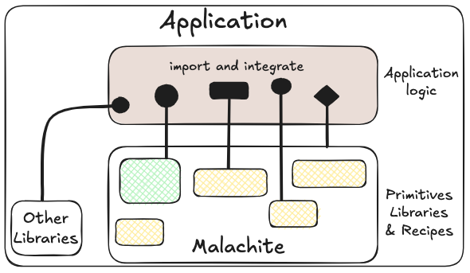
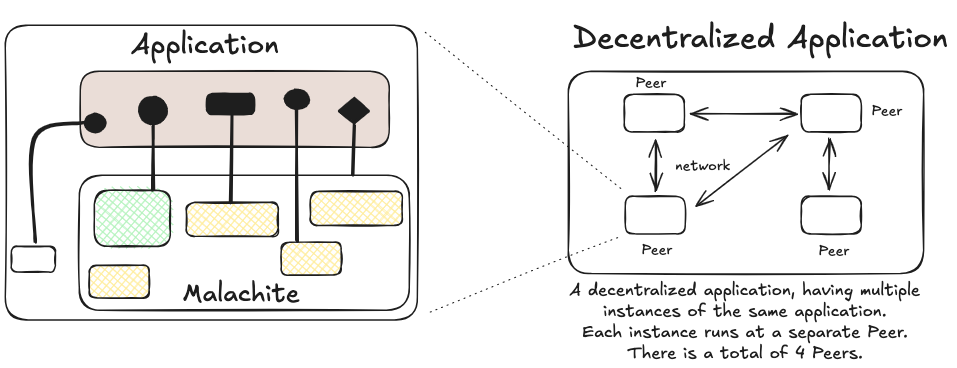
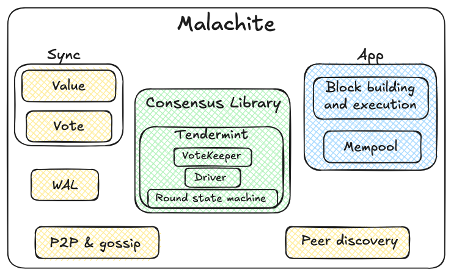
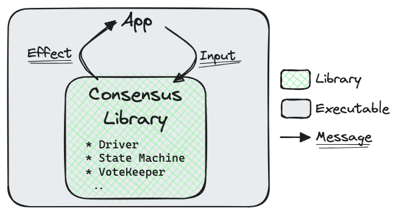

# Malachite Architecture

This document describes the high-level architecture of Malachite.
If you want to familiarize yourself with the codebase, you are in the right place!

If are already familiar with the architecture of decentralized systems, feel free to skip the Bird's Eye View section by proceeding directly to [Malachite APIs and Design](#malachite-design).

## Bird's Eye View

At the highest level, Malachite is a Byzantine-fault tolerant consensus engine.
It enables developers to build decentralized, fault-tolerant applications.

To facilitate the building of decentralized applications, developers use Malachite as a collection of primitives, libraries, and recipes that they integrate into their application.
Besides Malachite, the application likely imports and integrates other libraries.
The following image sketches the mental model for understanding the abstract relationship between Malachite and the application.



### Decentralized applications 101

In practice, applications built on top of Malachite will operate on a network comprising multiple peers.
Each peer runs its own instance of the application. Peers stay connected over the network, and
some peers may be faulty, for example, they may crash or send malformed messages.



The main challenge is for the application state across all peers to be consistent.
This is where Malachite comes into play.

#### Malachite concerns

As mentioned already, Malachite libraries, primitives, and recipes function as building blocks for application developers.
For example, the application might be a decentralized sequencer.
In this case, each peer of the application should produce the same sequence of blocks.
Alternatively, the application might be a decentralized social network.
The application state in such a case would require that all peers agree on which user accounts (i.e., social accounts) exist and what is the timeline of each account; to achieve this, the application would produce, intuitively, a totally ordered list of accounts and timelines.

The building blocks that Malachite offers take care of concerns such as follows:

- Ensure that all peers produce the same sequence of outputs, e.g., sequencer blocks or user accounts
- In case a peer crashes, it is able to resume executing in a safe way, from a prior state
- In case a minority of peers are faulty, the network should still operate properly
- Ensure that no correct peer will ever revert or alter an output that was committed

#### Application concerns

As described above, by instantiating Malachite building blocks in their application, developers do not need to focus on concerns related to replication and fault-tolerance.
Instead, they focus on the strictly necessary, core part of what they are building.
Namely, the application logic, which typically entails problems such as:

- What to do with a new output that the network of peers produced?
- What should a decided value consist of?
- Should the application execute actions before, during, or after the peers reach a decision?

The application developer may also be concerned about more advanced topics.
Malachite is flexible and amenable to an extensive range of customizations, for example:

- What kind of networking layer may be most appropriate for the nodes running the application?
- Should the application handle the dissemination of user transactions using a mempool?
- What kind of signature schemes should be used?
- Should peers catch up with one another using an advanced protocol, or re-use the one that Malachite provides?

## Malachite Design

### Values and Votes

We use the term _value_ to denote a new value that is finalized.
For example, each value can be seen as a new block.
A _vote_ is one of the intermediary steps that peers take to reach a decision on a certain value.

These terms are inspired by the [article describing Tendermint consensus algorithm][tendermint-article].
Malachite is more general than Tendermint, however, and we aim to eventually bundle additional consensus algorithms beyond this one.

### Components

Malachite comes initially bundled with the following components.



The core of Malachite is marked in green background and comprises three basic modules:

1. Vote Keeper: For aggregating votes from peers and keeping track of quorums
2. Round State Machine: Implements the Tendermint consensus algorithm logic within a round
3. Driver: Operates the state machine across multiple consensus rounds

This consensus library makes no assumptions about the environment in which it runs or what kind of applications are built with it.
It represents, to the best of our knowledge, the most flexible consensus API in the world.

Besides this core library, applications can use various other primitives that Malachite exports.
These include synchronization support enabling peers to catch up in terms of Votes or Values, a Write-Ahead-Log (WAL) to enable safe recovery from crashes, a peer-to-peer networking layer based on [libp2p](https://libp2p.io).

### Building an application

There are currently three ways to decentralize an application using Malachite:

#### Channel-based interface
The first one is to make us of the high-level channel-based interface to the consensus engine that is provided by the `malachite-app-channel` crate.
Using the high-level interface will provide the application with all the features built into Malachite, such as synchronization, crash recovery and networking. The downside is that the application cannot choose a different networking layer or define its own synchronization protocol.

[See the corresponding tutorial](/docs/tutorials/channels.md) for a detailed walkthrough.

#### Actor-based interface
The other way is to make use of the slightly lower level actor-based interface, which allows application developers to switch one actor implementation for another, in order to for instance use a different networking layer than the libp2p-based one.
It will then be up to the application to spawn and wire the actors together, which is more complex than using the channel-based interface, but allows for more flexibility.

There is not tutorial for doing this at the moment.
Please [open a discussion](https://github.com/circlefin/malachite/discussions) on GitHub if you want to discuss this approach or get help for swapping parts of the engine in and out.

#### Low-level interface
If none of these approaches are flexible enough for your application, another way to leverage Malachite is to use its low-level core consensus library, which is fully agnostic with regard to all aspects outside of core consensus.
It therefore allows an application to define its own networking layer, synchronization protocol, execution environment (eg. in a browser when compiled to WASM or using system threads for concurrency instead of actors or Tokio).

Keep on reading for more information about this library provided by Malachite.

### Core Consensus Library

### Building with the consensus library directly

By default, application developers may not want to build on top of the consensus library directly, and instead use higher-level primitives.
We provide in [docs/tutorials](./docs/tutorials) and in [examples](./code/examples) ways to do so.
If you are still interested in understanding the core library, then please read on.

### Overview

The Malachite consensus library is pure, i.e., it does not perform any input/output nor result in side effects.
The library is also stateless, i.e., it expects the caller to provide any state relevant as input to any call.
This allows a high level of portability, enabling Malachite to be flexible to deployment in a very wide variety of environments or applications.
Given this design, the consensus library requires a Host, i.e., an environment in which it executes.
At the moment the term "Host" is interchangeable with "Application" since the former is very minimal and only serves as a bridge between the engine and the application. In the future, we intend to provide a more capable host that will relieve the application of some of its current duties.

#### Consensus Library Architecture

This sketch shows the architecture of the consensus library.



The Malachite consensus library API consists of two sets of interfaces which the Host can use to run the library and build a meaningful application. Each interface is a set of messages. The first interface represents the set of input messages. The second one is the set of output messages. We call the former Inputs and the latter Effects.

At this highest level, the Host invokes Malachite with a certain Input message, and Malachite yields potentially an Effect to the Host.

In the current design, to simplify the management of the Host/Malachite interaction, we employ a macro as follows:

```rust
malachite_consensus::process!(
	input: input,
	state: &mut state.consensus,
	metrics: &self.metrics,
	with: effect => {
	    self.handle_effect(myself, &mut state.timers, &mut state.timeouts, effect).await
	}
)
```

The Host implements the `handle_effect` method, and we can think of this as the top-level loop — or controller — for the application to use.

##### Inputs and Effects

We define the set of all the possible Inputs that the Malachite library supports as an `enum`.
The Inputs are defined in `core-consensus/src/input.rs`:

https://github.com/circlefin/malachite/blob/6f4cfce72fa0362d743320c0e3ea8fa46b4283b0/code/crates/core-consensus/src/input.rs#L13-L44


The `enum` that captures all the possible variations of an Effect is more verbose than Inputs, and is defined in `core-consensus/src/effect.rs`:

https://github.com/circlefin/malachite/blob/6f4cfce72fa0362d743320c0e3ea8fa46b4283b0/code/crates/core-consensus/src/effect.rs#L48-L150

The variants that are most interesting among Effects are these four:

1. Publish: Malachite instructs the Host to broadcast to other peers in the network a certain consensus message. The type `SignedConsensusMsg` is also an enum of two variants:

https://github.com/circlefin/malachite/blob/6f4cfce72fa0362d743320c0e3ea8fa46b4283b0/code/crates/core-consensus/src/types.rs#L13-L16

2. GetValue: Using this variant, Malachite asks the Host to provide a value to serve as a proposal to the consensus protocol. Put differently, this value is the next block to build.
3. SignProposal: Malachite asks the Host to sign a value to be proposed.
4. SignVote: Malachite asks the Host to sign a vote that votes on a value received from another peer.
5. Decide: With this variant, Malachite communicates to the Host that the network of peers has finalized a new value — e.g., a block — and therefore the application can process it.

Regarding the `SignProposal` variant, something interesting to note is that `Ctx::Proposal` is an associated type.
Malachite is unaware of the specific implementation of a Proposal;
it only constraints that any implementation satisfies the `Ctx::Proposal` trait.
Furthermore, this trait is generic over a type which we call a `Context`.
The full definition of `Ctx::Proposal` trait looks like this:

https://github.com/circlefin/malachite/blob/53a9d9e071e773ff959465f2836648d8ad2a5c74/code/crates/core-types/src/proposal.rs#L5-L28

Inputs, Effects, and the Context are the three key types that make up the Malachite consensus library.

## Going further

To explore further topics, we encourage reading [docs/tutorials](./docs/tutorials) and experimenting with the applications in [examples](./code/examples).


[tendermint-article]: https://arxiv.org/abs/1807.04938
