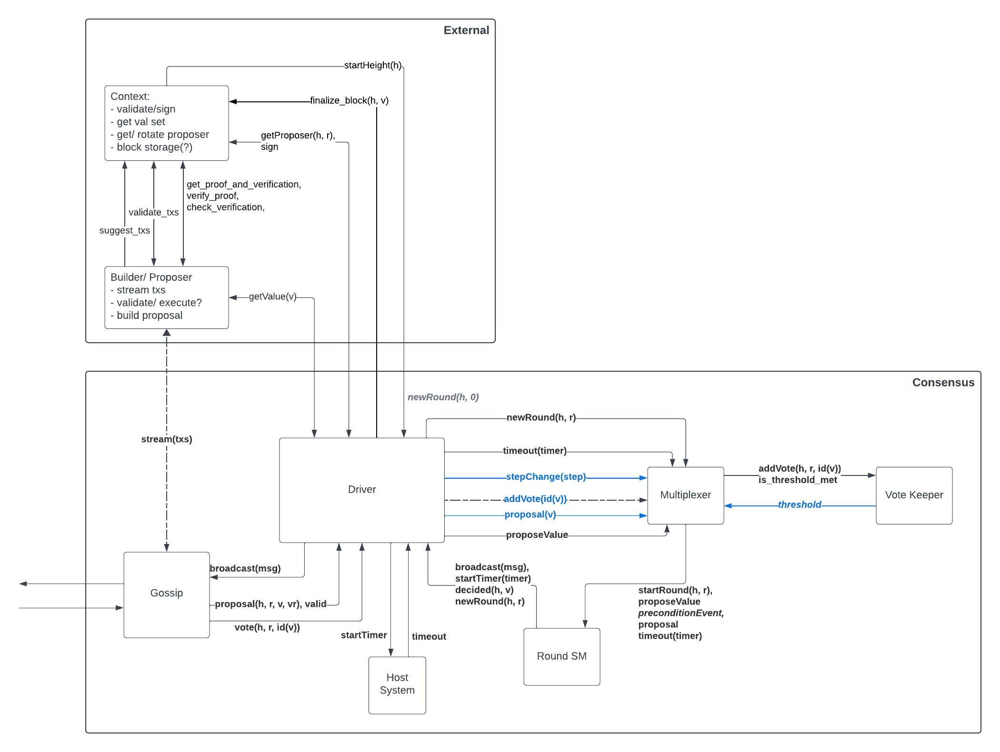

# ADR 001: High Level Architecture for Tendermint Consensus Implementation in Rust

## Changelog
* 2023-10-27: First draft.

## Context

This ADR provides architecture and design recommendations for the implementation of the Tendermint consensus protocol in Rust. The implementation follows the article ["The latest gossip on BFT consensus"](#References) and the English and Quint specifications located in the [Specs](../../Specs) directory.

### Terminology

We use terminology in line with [prior art on Tendermint and BFT consensus](https://docs.cometbft.com/v0.34/introduction/). To recall briefly:
- The consensus implementation reaches a decision on a _value_, which is the primary output. This is done repeatedly, such that the system proceeds in _heights_, and each height produces a new _value_.
- To reach decision on a value in a given height, multiple _rounds_ may be necessary. The algorithm starts from _round 0_.
- The implementation relies on exchanges of _proposals_ and _votes_. Each _round_ is associated with a specific _proposer_ which has the role of proposing a value to be decided upon.

## Decision

### Repository Overview

The repository is split in three areas, each covering one of the important areas of this project:
1. [Code](../../Code): Comprises the Rust implementation of the Tendermint consensus algorithm, split across multiple Rust crates.
2. [Docs](../../Docs): Comprises Architectural Decision Records (ADRs) such as the present file and other documentation.
3. [Specs](../../Specs): English and Quint specifications.

### Overview of the Tendermint Consensus Implementation 

The consensus implementation consists of the following components:
- Networking Module
- Host System
- Consensus Driver
- Multiplexer
- Vote Keeper
- Round State Machine

This Specification Document describes the architecture of the Consensus Driver, Multiplexer, Vote Keeper and Round State Machine.

The Networking module ensures that all messages sent by correct processes are eventually delivered to all correct processes.
It is likely that it will be implemented as a separate crate. Its specification will be described in a separate document.

The diagram shows the interactions between the consensus components and the external environment via the Context trait.
The precise external APIs and interactions are still work in progress.
The Proposer Builder module is responsible for building proposals that include transactions, state diffs and proofs. Its purpose is to build complete proposals. When run by a proposer this may mean collecting batches of transactions from the mempool and the required proofs from a prover, and disseminating them to all other validators. When run by any validator it is responsible for validating transactions and proofs, receiving the consensus proposal and building a complete proposal, validating the state diffs, and making the proposal available to consensus engine:
- via the `get_value()` method when the validator is the proposer for the given round
- via the `proposal()` method when the validator is non-proposer
The Proposer Builder module is not described in this document. It will be implemented as a separate crate. Its specification will be described in a separate document.



The components of the consensus implementation as well as the associated abstractions are described in more detail below.

### Data Types & Abstractions

#### Context

The Tendermint consensus implementation will satisfy the `Context` interface, detailed below.
The data types used by the consensus algorithm are abstracted to allow for different implementations.

```rust
/// This trait allows to abstract over the various datatypes
/// that are used in the consensus engine.
pub trait Context
where
    Self: Sized,
{
    /// The type of address of a validator.
    type Address: Address;

    /// The type of the height of a block.
    type Height: Height;

    /// The interface provided by the proposal type.
    type Proposal: Proposal<Self>;

    /// The interface provided by the validator type.
    type Validator: Validator<Self>;

    /// The interface provided by the validator set type.
    type ValidatorSet: ValidatorSet<Self>;

    /// The type of values that can be proposed.
    type Value: Value;

    /// The type of votes that can be cast.
    type Vote: Vote<Self>;

    /// The signing scheme used to sign votes.
    type SigningScheme: SigningScheme;

    /// Sign the given vote our private key.
    fn sign_vote(&self, vote: Self::Vote) -> SignedVote<Self>;

    /// Verify the given vote's signature using the given public key.
    fn verify_signed_vote(
        &self,
        signed_vote: &SignedVote<Self>,
        public_key: &PublicKey<Self>,
    ) -> bool;

    /// Build a new proposal for the given value at the given height, round and POL round.
    fn new_proposal(
        height: Self::Height,
        round: Round,
        value: Self::Value,
        pol_round: Round,
    ) -> Self::Proposal;

    /// Build a new prevote vote by the validator with the given address,
    /// for the value identified by the given value id, at the given round.
    fn new_prevote(
        height: Self::Height,
        round: Round,
        value_id: NilOrVal<ValueId<Self>>,
        address: Self::Address,
    ) -> Self::Vote;

    /// Build a new precommit vote by the validator with the given address,
    /// for the value identified by the given value id, at the given round.
    fn new_precommit(
        height: Self::Height,
        round: Round,
        value_id: NilOrVal<ValueId<Self>>,
        address: Self::Address,
    ) -> Self::Vote;
}
```

#### Consensus Driver

##### Data Structures

The Consensus Driver is concerned with running the consensus algorithm for a single height, i.e. it drives the state machine across multiple rounds.

It is therefore initialized with the height once and the instance is destroyed once a value for that height has been decided. Other parameters are required during initialization and operation as described below.

```rust
pub struct Driver<Ctx>
    where
        Ctx: Context,
{
    /// The context of the consensus engine,
    /// for defining the concrete data types and signature scheme.
    pub ctx: Ctx,

    /// The proposer selector.
    pub proposer_selector: Box<dyn ProposerSelector<Ctx>>,

    /// The address of the node.
    pub address: Ctx::Address,

    /// The validator set at the current height
    pub validator_set: Ctx::ValidatorSet,

    /// The vote keeper.
    pub vote_keeper: VoteKeeper<Ctx>,

    /// The state of the round state machine.
    pub round_state: RoundState<Ctx>,

    /// The proposal to decide on, if any.
    pub proposal: Option<Ctx::Proposal>,

    /// The pending input to be processed next, if any.
    pub pending_input: Option<(Round, RoundInput<Ctx>)>,
}

```

##### Input Events (External APIs)

The Consensus Driver receives input events from the peer-to-peer layer and other external modules it interacts with. 

```rust
pub enum Input<Ctx>
    where
        Ctx: Context,
{
    /// Start a new round
    NewRound(Ctx::Height, Round),

    /// Propose a value for the given round
    ProposeValue(Round, Ctx::Value),

    /// Receive a proposal, of the given validity
    Proposal(Ctx::Proposal, Validity),

    /// Receive a vote
    Vote(Vote<Ctx>),

    /// Receive a timeout
    TimeoutElapsed(Timeout),
}

```
Notes:
- Round `0` is always started by an external module. Subsequent rounds are started by the driver when the Round State Machine indicates it via the `NewRound` message.
- A proposal event must include a proposal and a `valid` flag indicating if the proposal is valid. The proposal must be complete, i.e. it must contain a complete value or an identifier of the value (`id(v)`). If the value is sent by the proposer in multiple parts, it is the responsibility of the Builder/Proposal modules to collect and verify all the parts and the proposal message in order to create a complete proposal and the validity flag.
- `Vote` can be a `Prevote` or `Precommit` vote.
- The driver interacts with the host system to start timers and expects to receive timeout events for the timers that it started and have fired. The timeouts can be:
  * `Propose`
  * `Prevote`
  * `Precommit`

##### Operation

The Driver sends votes to the Multiplexer module. The Driver expects that, whenever the Muliplexer (via the Vote Keeper) observes any threshold of votes for the first time and based on its state, it returns the multiplexed event to the Driver.

The Driver sends the multiplexed events to the Round State Machine which, once it processes the Driver inputs, returns consensus-related messages back to the Driver. The Driver then processes these messages and sends them to the Networking module, the External environment (e.g. the block to finalize is sent to the Blockchain module via the `finalize_block()`) , the Host System, or in some cases processes them internally (e.g. `NewRound(round)` message).

Notes:
- Proposals and vote messages must be signed by the sender and validated by the receiver. Signer must be the proposer for `Proposal` and a validator for `Vote`.
  - The driver performs signature verification of the messages it receives from the consensus environment via methods provided by the Context (see `verify_signed_vote()`)
  - Note: Future investigations may require asynchronous signature verification.
- On `StartRound(round)` event, the Driver must determine if it is the proposer for the given round. For this it needs access to a `validator_set.get_proposer(round)` method or similar.
- When building a proposal the driver will use the `get_value()` method of the Builder/Proposer module to retrieve the value to propose. 

##### Output Messages

```rust
pub enum Output<Ctx>
    where
        Ctx: Context,
{
    /// Start a new round
    NewRound(Ctx::Height, Round),

    /// Broadcast a proposal
    Propose(Ctx::Proposal),

    /// Broadcast a vote for a value
    Vote(Vote<Ctx>),

    /// Decide on a value
    Decide(Round, Ctx::Value),

    /// Schedule a timeout
    ScheduleTimeout(Timeout),

    /// Ask for a value to propose and schedule a timeout
    GetValueAndScheduleTimeout(Round, Timeout),
}
```

### Driver Context

The driver is passed a instance of the `Context` trait which defines all the data types used by this instance of the consensus engine, and also provides synchronous, stateless methods for creating and signing votes.

#### Multiplexer

The Multiplexer is responsible for multiplexing the input data and returning the appropriate event to the Round State Machine.

The input data is:
- The step change from the Round State Machine.
- The threshold emitted by the Vote Keeper.
- Proposals and votes from the Driver.

The table below describes the input to the Multiplexer and the output events to the Round State Machine.

| Step Changed To | Vote Keeper Threshold | Proposal        | Multiplexed Input to Round SM   | New Step        | Algo Condition | Output                             |
|---------------- | --------------------- | --------------- |---------------------------------| ---------       | -------------- | ---------------------------------- |
| new(??)         | -                     | -               | NewRound                        | propose         | L11            | …                                  |
| any             | PrecommitValue(v)     | Proposal(v)     | PropAndPrecommitValue           | commit          | L49            | decide(v)                          |
| any             | PrecommitAny          | \*              | PrecommitAny                    | any (unchanged) | L47            | sch\_precommit\_timer              |
| propose         | none                  | InvalidProposal | InvalidProposal                 | prevote         | L22, L26       | prevote\_nil                       |
| propose         | none                  | Proposal        | Proposal                        | prevote         | L22, L24       | prevote(v)                         |
| propose         | PolkaPrevious(v, vr)  | InvalidProposal | InvalidProposalAndPolkaPrevious | prevote         | L28, L33       | prevote\_nil                       |
| propose         | PolkaPrevious(v, vr)  | Proposal(v,vr)  | ProposalAndPolkaPrevious        | prevote         | L28, L30       | prevote(v)                         |
| prevote         | PolkaNil              | \*              | PolkaNil                        | precommit       | L44            | precommit\_nil                     |
| prevote         | PolkaValue(v)         | Proposal(v)     | ProposalAndPolkaCurrent         | precommit       | L36, L37       | (set locked and valid)precommit(v) |
| prevote         | PolkaAny              | \*              | PolkaAny                        | prevote         | L34            | prevote timer                      |
| precommit       | PolkaValue(v)         | Proposal(v)     | ProposalAndPolkaCurrent         | precommit       | L36, L42       | (set valid)                        |


#### Vote Keeper

##### Data Structures

The Vote Keeper is concerned with keeping track of the votes received and the thresholds of votes observed for each round.
To this end, it maintains some state per each round:

```rust
/// Keeps track of votes and emitted outputs for a given round.
pub struct PerRound<Ctx>
where
    Ctx: Context,
{
    /// The votes for this round.
    votes: RoundVotes<Ctx::Address, ValueId<Ctx>>,
    /// The addresses and their weights for this round.
    addresses_weights: RoundWeights<Ctx::Address>,
    /// The emitted outputs for this round.
    emitted_outputs: BTreeSet<Output<ValueId<Ctx>>>,
}
```

```rust
/// Keeps track of votes and emits messages when thresholds are reached.
pub struct VoteKeeper<Ctx>
where
    Ctx: Context,
{
    /// The total weight (ie. voting power) of the network.
    total_weight: Weight,
    /// The threshold parameters.
    threshold_params: ThresholdParams,
    /// The votes and emitted outputs for each round.
    per_round: BTreeMap<Round, PerRound<Ctx>>,
}
```

- The quorum and minimum correct validator thresholds are passed in as parameters during initialization. These are used for the different threshold calculations.
- The `validator_set` is used to detect equivocation; also to ensure that prevote and precommit messages from the same validator are not counted twice for the same round, e.g. in the case of the `honest_threshold` case (`f+1` in L55 in the BFT paper) for prevotes and precommits.

##### Input Events (Internal APIs)

The Vote Keeper receives votes from the Consensus Driver via:

```rust
pub fn apply_vote(
    &mut self,
    vote: Ctx::Vote,
    weight: Weight,
    current_round: Round,
) -> Option<Output<ValueId<Ctx>>> 
```

##### Operation

The Vote Keeper keeps track of the votes received for each round and the total weight of the votes. It returns any thresholds seen **for the first time**.

##### Output Messages

The Driver receives these output messages from the Vote Keeper.

```rust
/// Messages emitted by the vote keeper
#[derive(Clone, Debug, PartialEq, Eq, PartialOrd, Ord, Hash)]
pub enum Output<Value> {
    /// We have a quorum of prevotes for some value or nil
    PolkaAny,

    /// We have a quorum of prevotes for nil
    PolkaNil,

    /// We have a quorum of prevotes for specific value
    PolkaValue(Value),

    /// We have a quorum of precommits for some value or nil
    PrecommitAny,

    /// We have a quorum of precommits for a specific value
    PrecommitValue(Value),

    /// We have f+1 honest votes for a value at a higher round
    SkipRound(Round),
}
```

#### Round State Machine

##### Data Structures

The Consensus State Machine is concerned with the internal state of the consensus algorithm for a given round. It is initialized with the height and round. When moving to a new round, the driver creates a new round state machine while retaining information from previous round (e.g. valid and locked values).

```rust
/// The state of the consensus state machine
pub struct State<Ctx>
where
    Ctx: Context,
{
    /// The height of the consensus
    pub height: Ctx::Height,

    /// The round we are at within a height
    pub round: Round,

    /// The step we are at within a round
    pub step: Step,

    /// The value we are locked on, ie. we have received a polka for before we precommitted
    pub locked: Option<RoundValue<Ctx::Value>>,

    /// The value for which we received a polka for after we already precommitted
    pub valid: Option<RoundValue<Ctx::Value>>,
}
```

##### Input Events (Internal APIs)

The Round state machine receives events from the Consensus Driver via:

```rust
pub fn apply(self, data: &Info<Ctx>, input: Input<Ctx>) -> Transition<Ctx> {
```

The events passed to the Round state machine are very close to the preconditions for the transition functions in the BFT paper, i.e., the `upon` clauses.
In addition:
- The `StartRound` events specify if the SM runs in the proposer mode or not. In the former case, the driver also passes a valid value to the round SM.
- There are two `Proposal` events, for valid and invalid values respectively. Therefore, the `valid(v)` check is not performed in the round SM but by the Driver

```rust
pub enum Input<Ctx>
    where
        Ctx: Context,
{
    /// Start a new round, either as proposer or not.
    /// L14/L20
    NewRound,

    /// Propose a value.
    /// L14
    ProposeValue(Ctx::Value),

    /// Receive a proposal.
    /// L22 + L23 (valid)
    Proposal(Ctx::Proposal),

    /// Receive an invalid proposal.
    /// L26 + L32 (invalid)
    InvalidProposal,

    /// Received a proposal and a polka value from a previous round.
    /// L28 + L29 (valid)
    ProposalAndPolkaPrevious(Ctx::Proposal),

    /// Received a proposal and a polka value from a previous round.
    /// L28 + L29 (invalid)
    InvalidProposalAndPolkaPrevious(Ctx::Proposal),

    /// Receive +2/3 prevotes for anything.
    /// L34
    PolkaAny,

    /// Receive +2/3 prevotes for nil.
    /// L44
    PolkaNil,

    /// Receive +2/3 prevotes for a value in current round.
    /// L36
    ProposalAndPolkaCurrent(Ctx::Proposal),

    /// Receive +2/3 precommits for anything.
    /// L47
    PrecommitAny,

    /// Receive +2/3 precommits for a value.
    /// L49
    ProposalAndPrecommitValue(Ctx::Proposal),

    /// Receive +1/3 messages from a higher round. OneCorrectProcessInHigherRound.
    /// L55
    SkipRound(Round),

    /// Timeout waiting for proposal.
    /// L57
    TimeoutPropose,

    /// Timeout waiting for prevotes.
    /// L61
    TimeoutPrevote,

    /// Timeout waiting for precommits.
    /// L65
    TimeoutPrecommit,
}
```

##### Operation

The Round State Machine keeps track of the internal state of consensus for a given round. It resembles very closely the algorithm description in the [original "The Latest gossip on BFT consensus" paper](#References).

##### Output Messages

The Round state machine returns the following output messages to the Driver:

```rust
/// Output of the round state machine.
pub enum Output<Ctx>
where
    Ctx: Context,
{
    /// Move to the new round.
    NewRound(Round),

    /// Broadcast the proposal.
    Proposal(Ctx::Proposal),

    /// Broadcast the vote.
    Vote(Ctx::Vote),

    /// Schedule the timeout.
    ScheduleTimeout(Timeout),

    /// Ask for a value and schedule a timeout.
    GetValueAndScheduleTimeout(Round, Timeout),

    /// Decide the value.
    Decision(RoundValue<Ctx::Value>),
}
```

## Status

Accepted

## Consequences

### Positive

- The abstraction offered by `enum Input` state machine input encapsulates all the complexity of `upon` clauses, it simplifies reasoning about the pure state machine logic within the Round State Machine.
- The semantics of counting votes and reasoning about thresholds is grouped into the Vote Keeper module and clearly separates that concern from the state machine logic.
- Functionality is offloaded to the host system wherever possible: the concerns of scheduling, managing, and firing timeouts.
- All sources of non-determinism are outside the boundaries of the consensus implementation, e.g. `valid` method, timeouts, I/O triggers, thus simplifying testing and reasoning about this system.

### Negative

- The `enum Input` has numerous variants and comprises many nuances, thus may be difficult to understand.

### Neutral

- The concept of `Vote` is borrowed from earlier implementations of Tendermint consensus algorithm and this may be at times ambiguous.
- The concept of `Height` is borrowed from ["The latest gossip.."](#references) article and it may be inaccurate in some contexts. For example, a height is a straightforward concept in the context of implementing a blockchain system, but it may be inappropriate in the implementation of general-purpose sequencing systems, total-order logs, or atomic broadcast.  

## References

* [CometBFT v0.34 docs](https://docs.cometbft.com/v0.34/introduction/)
* ["The latest gossip on BFT consensus"](https://arxiv.org/pdf/1807.04938.pdf), by _Buchman, Kwon, Milosevic_. 2018.
