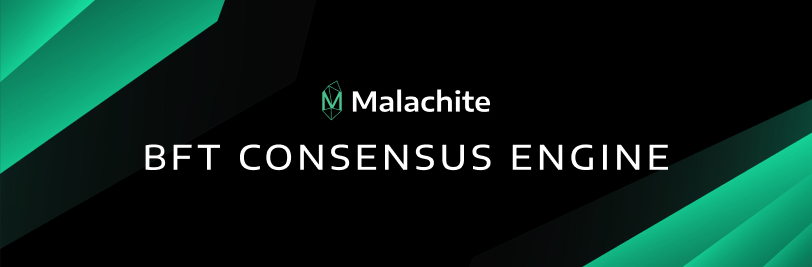

<h1 align="center">

</h1>

<h4 align="center">
    Flexible BFT Consensus Engine in Rust 
    State-of-the-art implementation of Tendermint
</h4>

---

[![Build Status][build-image]][build-link]
[![Quint tests][quint-image]][quint-link]
[![MBT tests][mbt-test-image]][mbt-test-link]
[![Code coverage][coverage-image]][coverage-link]

[![Apache 2.0 Licensed][license-image]][license-link]
![Rust Stable][rustc-image]
![Rust 1.82+][rustc-version]
[![Quint 0.22][quint-version]][quint-repo]

[![Telegram Chat][tg-badge]][tg-url]

[![Documentation][docs-main-image]][docs-main-link]

## About

Malachite is a Byzantine-fault tolerant (BFT) consensus engine implemented in Rust.

Malachite `/ˈmæl.ə.kaɪt/` is pronounced as follows: __"Mala"__ (like in Malaysia) + __"kite"__ (like the flying toy).

> [!IMPORTANT]
> Malachite is pre-alpha software and still under heavy development.
> At this stage, it is not meant for use in production.
> The software is provided "as is" and has not been externally audited; use at your own risk.

### Goals

The goal is for Malachite to enable developers to decentralize whatever the future may bring—sequencers, social networks, Layer 1s, etc.
Therefore, Malachite addresses a particular void in the market: The lack of flexible, reliable, and high-performance distributed systems foundations, such as BFT consensus libraries.

### Features

#### Tendermint as a Library
Bundled with Malachite comes a state-of-the-art implementation of the Tendermint BFT consensus algorithm.
Tendermint is an [optimistically responsive][responsive] consensus algorithm, and therefore exhibits high-performance, and has found adoption in many decentralized systems through its implementation in Go as part of [CometBFT](https://github.com/cometbft/cometbft/).

#### Design
Key [design decisions][announcement] in Malachite are heavily inspired by lessons and experiences of maintaining CometBFT throughout the years.
Malachite addresses numerous points of technical debt in the design of consensus engines, resulting in a lean, flexible, and reliable solution that performs at the highest level.

#### Reliability and Performance
Parts of Malachite were co-designed with their formal specification and model checking, notably for the Tendermint algorithm, which improved the confidence and reliability of this core library.

Early [experiments][announcement] with Malachite show an average finalization latency of 780 ms at a scale of 100 validators with 1MB blocks.
Depending on the setup, Malachite can clear up to 2.5 blocks per second or finalize up to 13.5 MB/s (around 50,000 transactions per second).

#### Use-cases
Malachite originated as a consensus core for the Starknet L2 decentralized sequencer.
It will serve as the core consensus library in the [Madara][madara] and [Pathfinder][pathfinder] Starknet clients.
Malachite is also being used for Farcaster’s newest backend layer called [Snapchain](https://github.com/farcasterxyz/snapchain-v0/).
Thanks to its flexible design, Malachite is amenable to a broad range of environments, and a number of other teams are building and exploring in private.
Please reach-out if interested, we would love to speak with more teams.

## Overview

### Repository

The repository is split into three areas, each covering one of the important aspects of this project:

1. [code](./code): Contains the Rust implementation of the Tendermint consensus algorithm, split across multiple Rust crates.
2. [docs](./docs): Contains Architectural Decision Records (ADRs) and other documentation, such as the 2018 paper describing the core consensus algorithm.
3. [specs](./specs): Contains English and [Quint][quint-repo] specifications.

### Crates and Status

> [!NOTE]
> The actual name of each crate is prefixed with `informalsystems-malachitebft-`.
> For instance, the crate denoted by `core-consensus` below can be found on crates.io as `informalsystems-malachitebft-core-consensus`.

#### Core consensus algorithm

|                       Crate name                      |                                         Crate                                          |                                           Docs                                            |
|:------------------------------------------------------|:--------------------------------------------------------------------------------------:|:-----------------------------------------------------------------------------------------:|
|      [core-consensus](code/crates/core-consensus)     | [![core-consensus][core-consensus-crate-image]][core-consensus-crate-link]             | [![core-consensus Docs][core-consensus-docs-image]][core-consensus-docs-link]             |
|         [core-driver](code/crates/core-driver)        | [![core-driver][core-driver-crate-image]][core-driver-crate-link]                      | [![core-driver Docs][core-driver-docs-image]][core-driver-docs-link]                      |
|  [core-state-machine](code/crates/core-state-machine) | [![core-state-machine][core-state-machine-crate-image]][core-state-machine-crate-link] | [![core-state-machine Docs][core-state-machine-docs-image]][core-state-machine-docs-link] |
|          [core-types](code/crates/core-types)         | [![core-types][core-types-crate-image]][core-types-crate-link]                         | [![core-types Docs][core-types-docs-image]][core-types-docs-link]                         |
|     [core-votekeeper](code/crates/core-votekeeper)    | [![core-votekeeper][core-votekeeper-crate-image]][core-votekeeper-crate-link]          | [![core-votekeeper Docs][core-votekeeper-docs-image]][core-votekeeper-docs-link]          |

#### Consensus engine

|                 Crate name                 |                               Crate                               |                                 Docs                                 |
|-------------------------------------------:|:-----------------------------------------------------------------:|:--------------------------------------------------------------------:|
| [app-channel](./code/crates/app-channel)   | [![app-channel][app-channel-crate-image]][app-channel-crate-link] | [![app-channel Docs][app-channel-docs-image]][app-channel-docs-link] |
|         [app](./code/crates/app)           |             [![app][app-crate-image]][app-crate-link]             |             [![app Docs][app-docs-image]][app-docs-link]             |
|       [codec](./code/crates/codec)         |          [![codec][codec-crate-image]][codec-crate-link]          |          [![codec Docs][codec-docs-image]][codec-docs-link]          |
|      [config](./code/crates/config)        |        [![config][config-crate-image]][config-crate-link]         |        [![config Docs][config-docs-image]][config-docs-link]         |
|   [discovery](./code/crates/discovery)     |    [![discovery][discovery-crate-image]][discovery-crate-link]    |    [![discovery Docs][discovery-docs-image]][discovery-docs-link]    |
|      [engine](./code/crates/engine)        |        [![engine][engine-crate-image]][engine-crate-link]         |        [![engine Docs][engine-docs-image]][engine-docs-link]         |
|     [metrics](./code/crates/metrics)       |       [![metrics][metrics-crate-image]][metrics-crate-link]       |       [![metrics Docs][metrics-docs-image]][metrics-docs-link]       |
|     [network](./code/crates/network)       |       [![network][network-crate-image]][network-crate-link]       |       [![network Docs][network-docs-image]][network-docs-link]       |
|        [peer](./code/crates/peer)          |           [![peer][peer-crate-image]][peer-crate-link]            |           [![peer Docs][peer-docs-image]][peer-docs-link]            |
|       [proto](./code/crates/proto)         |          [![proto][proto-crate-image]][proto-crate-link]          |          [![proto Docs][proto-docs-image]][proto-docs-link]          |
|        [sync](./code/crates/sync)          |           [![sync][sync-crate-image]][sync-crate-link]            |           [![sync Docs][sync-docs-image]][sync-docs-link]            |
|         [wal](./code/crates/wal)           |             [![wal][wal-crate-image]][wal-crate-link]             |             [![wal Docs][wal-docs-image]][wal-docs-link]             |

### Building with Malachite

As a guiding point to understand how to use Malachite, please read [ARCHITECTURE.md](ARCHITECTURE.md).

You can also check out the [examples](./code/examples) for a more in-depth experience.

### Contributing

If you would like to contribute to the Malachite open-source codebase, please see [CONTRIBUTING.md](./CONTRIBUTING.md).
We invite all contributors.

## Requirements

- Rust v1.82+ ([rustup.rs](https://rustup.rs))
- Quint v0.22+ ([github.com](https://github.com/informalsystems/quint))
- Protobuf v29.0+ ([protobuf.dev](https://protobuf.dev/))

## Join Us

Malachite is developed by [Informal Systems](https://informal.systems).

If you'd like to work full-time on challenging problems of distributed systems and decentralization,
[we're always looking for talented people to join](https://informal.systems/careers)!

## Acknowledgements

Malachite would not have been possible without the kind support of the Starknet ecosystem.
We are grateful to StarkWare Industries for prompting the initial discussions of building Tendermint in Rust, to Starknet Foundation for funding and fostering a collaborative environment, and to both of these organizations plus numerous others in the ecosystem for their constructive feedback on earlier designs of Malachite.

We are also thankful for the collaboration with Farcaster.
This led to further refinements and maturing of the Malachite codebase, and their approach to building complex systems and shipping valuable products is an inspiration for us.

## License

Copyright © 2024 Informal Systems Inc.

Licensed under the Apache License, Version 2.0 (the "License"); you may not use the files in this repository except in compliance with the License. You may obtain a copy of the License at

    https://www.apache.org/licenses/LICENSE-2.0

Unless required by applicable law or agreed to in writing, software distributed under the License is distributed on an "AS IS" BASIS, WITHOUT WARRANTIES OR CONDITIONS OF ANY KIND, either express or implied. See the License for the specific language governing permissions and limitations under the License.

[docs-main-image]: https://img.shields.io/badge/docs-main-blue?logo=googledocs&logoColor=white
[docs-main-link]: https://informalsystems.github.io/malachite/
[build-image]: https://github.com/informalsystems/malachite/actions/workflows/rust.yml/badge.svg
[build-link]: https://github.com/informalsystems/malachite/actions/workflows/rust.yml
[quint-image]: https://github.com/informalsystems/malachite/actions/workflows/quint.yml/badge.svg
[quint-link]: https://github.com/informalsystems/malachite/actions/workflows/quint.yml
[mbt-test-image]: https://github.com/informalsystems/malachite/actions/workflows/mbt.yml/badge.svg
[mbt-test-link]: https://github.com/informalsystems/malachite/actions/workflows/mbt.yml
[coverage-image]: https://codecov.io/gh/informalsystems/malachite/graph/badge.svg?token=B9KY7B6DJF
[coverage-link]: https://codecov.io/gh/informalsystems/malachite
[license-image]: https://img.shields.io/badge/license-Apache_2.0-blue.svg
[license-link]: https://github.com/informalsystems/hermes/blob/master/LICENSE
[rustc-image]: https://img.shields.io/badge/Rust-stable-orange.svg
[rustc-version]: https://img.shields.io/badge/Rust-1.82+-orange.svg
[quint-version]: https://img.shields.io/badge/Quint-0.22-purple.svg
[quint-repo]: https://github.com/informalsystems/quint
[tg-url]: https://t.me/MalachiteEngine
[tg-badge]: https://img.shields.io/badge/Malachite-Engine-blue.svg?logo=data:image/svg+xml;base64,PHN2ZyB4bWxucz0iaHR0cDovL3d3dy53My5vcmcvMjAwMC9zdmciIHZpZXdCb3g9IjAgMCAyNCAyNCI+PHBhdGggZD0iTTEyIDI0YzYuNjI3IDAgMTItNS4zNzMgMTItMTJTMTguNjI3IDAgMTIgMCAwIDUuMzczIDAgMTJzNS4zNzMgMTIgMTIgMTJaIiBmaWxsPSJ1cmwoI2EpIi8+PHBhdGggZmlsbC1ydWxlPSJldmVub2RkIiBjbGlwLXJ1bGU9ImV2ZW5vZGQiIGQ9Ik01LjQyNSAxMS44NzFhNzk2LjQxNCA3OTYuNDE0IDAgMCAxIDYuOTk0LTMuMDE4YzMuMzI4LTEuMzg4IDQuMDI3LTEuNjI4IDQuNDc3LTEuNjM4LjEgMCAuMzIuMDIuNDcuMTQuMTIuMS4xNS4yMy4xNy4zMy4wMi4xLjA0LjMxLjAyLjQ3LS4xOCAxLjg5OC0uOTYgNi41MDQtMS4zNiA4LjYyMi0uMTcuOS0uNSAxLjE5OS0uODE5IDEuMjI5LS43LjA2LTEuMjI5LS40Ni0xLjg5OC0uOS0xLjA2LS42ODktMS42NDktMS4xMTktMi42NzgtMS43OTgtMS4xOS0uNzgtLjQyLTEuMjA5LjI2LTEuOTA4LjE4LS4xOCAzLjI0Ny0yLjk3OCAzLjMwNy0zLjIyOC4wMS0uMDMuMDEtLjE1LS4wNi0uMjEtLjA3LS4wNi0uMTctLjA0LS4yNS0uMDItLjExLjAyLTEuNzg4IDEuMTQtNS4wNTYgMy4zNDgtLjQ4LjMzLS45MDkuNDktMS4yOTkuNDgtLjQzLS4wMS0xLjI0OC0uMjQtMS44NjgtLjQ0LS43NS0uMjQtMS4zNDktLjM3LTEuMjk5LS43OS4wMy0uMjIuMzMtLjQ0Ljg5LS42NjlaIiBmaWxsPSIjZmZmIi8+PGRlZnM+PGxpbmVhckdyYWRpZW50IGlkPSJhIiB4MT0iMTEuOTkiIHkxPSIwIiB4Mj0iMTEuOTkiIHkyPSIyMy44MSIgZ3JhZGllbnRVbml0cz0idXNlclNwYWNlT25Vc2UiPjxzdG9wIHN0b3AtY29sb3I9IiMyQUFCRUUiLz48c3RvcCBvZmZzZXQ9IjEiIHN0b3AtY29sb3I9IiMyMjlFRDkiLz48L2xpbmVhckdyYWRpZW50PjwvZGVmcz48L3N2Zz4K
[responsive]: https://informal.systems/blog/tendermint-responsiveness
[announcement]: https://informal.systems/blog/malachite-decentralize-whatever
[madara]: https://github.com/madara-alliance/madara
[pathfinder]: https://github.com/eqlabs/pathfinder

[//]: # (crates.io and docs.rs: links and badges)
[core-consensus-crate-image]: https://img.shields.io/crates/v/informalsystems-malachitebft-core-consensus
[core-consensus-crate-link]: https://crates.io/crates/informalsystems-malachitebft-core-consensus
[core-driver-crate-image]: https://img.shields.io/crates/v/informalsystems-malachitebft-core-driver
[core-driver-crate-link]: https://crates.io/crates/informalsystems-malachitebft-core-driver
[core-state-machine-crate-image]: https://img.shields.io/crates/v/informalsystems-malachitebft-core-state-machine
[core-state-machine-crate-link]: https://crates.io/crates/informalsystems-malachitebft-core-state-machine
[core-types-crate-image]: https://img.shields.io/crates/v/informalsystems-malachitebft-core-types
[core-types-crate-link]: https://crates.io/crates/informalsystems-malachitebft-core-types
[core-votekeeper-crate-image]: https://img.shields.io/crates/v/informalsystems-malachitebft-core-votekeeper
[core-votekeeper-crate-link]: https://crates.io/crates/informalsystems-malachitebft-core-votekeeper
[core-consensus-docs-image]: https://img.shields.io/docsrs/informalsystems-malachitebft-core-consensus
[core-consensus-docs-link]: https://docs.rs/informalsystems-malachitebft-core-consensus
[core-driver-docs-image]: https://img.shields.io/docsrs/informalsystems-malachitebft-core-driver
[core-driver-docs-link]: https://docs.rs/informalsystems-malachitebft-core-driver
[core-state-machine-docs-image]: https://img.shields.io/docsrs/informalsystems-malachitebft-core-state-machine
[core-state-machine-docs-link]: https://docs.rs/informalsystems-malachitebft-core-state-machine
[core-types-docs-image]: https://img.shields.io/docsrs/informalsystems-malachitebft-core-types
[core-types-docs-link]: https://docs.rs/informalsystems-malachitebft-core-types
[core-votekeeper-docs-image]: https://img.shields.io/docsrs/informalsystems-malachitebft-core-votekeeper
[core-votekeeper-docs-link]: https://docs.rs/informalsystems-malachitebft-core-votekeeper
[app-channel-crate-image]: https://img.shields.io/crates/v/informalsystems-malachitebft-app-channel
[app-channel-crate-link]: https://crates.io/crates/informalsystems-malachitebft-app-channel
[app-channel-docs-image]: https://img.shields.io/docsrs/informalsystems-malachitebft-app-channel
[app-channel-docs-link]: https://docs.rs/informalsystems-malachitebft-app-channel
[app-crate-image]: https://img.shields.io/crates/v/informalsystems-malachitebft-app
[app-crate-link]: https://crates.io/crates/informalsystems-malachitebft-app
[codec-crate-image]: https://img.shields.io/crates/v/informalsystems-malachitebft-codec
[codec-crate-link]: https://crates.io/crates/informalsystems-malachitebft-codec
[config-crate-image]: https://img.shields.io/crates/v/informalsystems-malachitebft-config
[config-crate-link]: https://crates.io/crates/informalsystems-malachitebft-config
[discovery-crate-image]: https://img.shields.io/crates/v/informalsystems-malachitebft-discovery
[discovery-crate-link]: https://crates.io/crates/informalsystems-malachitebft-discovery
[engine-crate-image]: https://img.shields.io/crates/v/informalsystems-malachitebft-engine
[engine-crate-link]: https://crates.io/crates/informalsystems-malachitebft-engine
[metrics-crate-image]: https://img.shields.io/crates/v/informalsystems-malachitebft-metrics
[metrics-crate-link]: https://crates.io/crates/informalsystems-malachitebft-metrics
[network-crate-image]: https://img.shields.io/crates/v/informalsystems-malachitebft-network
[network-crate-link]: https://crates.io/crates/informalsystems-malachitebft-network
[peer-crate-image]: https://img.shields.io/crates/v/informalsystems-malachitebft-peer
[peer-crate-link]: https://crates.io/crates/informalsystems-malachitebft-peer
[proto-crate-image]: https://img.shields.io/crates/v/informalsystems-malachitebft-proto
[proto-crate-link]: https://crates.io/crates/informalsystems-malachitebft-proto
[sync-crate-image]: https://img.shields.io/crates/v/informalsystems-malachitebft-sync
[sync-crate-link]: https://crates.io/crates/informalsystems-malachitebft-sync
[wal-crate-image]: https://img.shields.io/crates/v/informalsystems-malachitebft-wal
[wal-crate-link]: https://crates.io/crates/informalsystems-malachitebft-wal
[app-docs-image]: https://img.shields.io/docsrs/informalsystems-malachitebft-app
[app-docs-link]: https://docs.rs/informalsystems-malachitebft-app
[codec-docs-image]: https://img.shields.io/docsrs/informalsystems-malachitebft-codec
[codec-docs-link]: https://docs.rs/informalsystems-malachitebft-codec
[config-docs-image]: https://img.shields.io/docsrs/informalsystems-malachitebft-config
[config-docs-link]: https://docs.rs/informalsystems-malachitebft-config
[discovery-docs-image]: https://img.shields.io/docsrs/informalsystems-malachitebft-discovery
[discovery-docs-link]: https://docs.rs/informalsystems-malachitebft-discovery
[engine-docs-image]: https://img.shields.io/docsrs/informalsystems-malachitebft-engine
[engine-docs-link]: https://docs.rs/informalsystems-malachitebft-engine
[metrics-docs-image]: https://img.shields.io/docsrs/informalsystems-malachitebft-metrics
[metrics-docs-link]: https://docs.rs/informalsystems-malachitebft-metrics
[network-docs-image]: https://img.shields.io/docsrs/informalsystems-malachitebft-network
[network-docs-link]: https://docs.rs/informalsystems-malachitebft-network
[peer-docs-image]: https://img.shields.io/docsrs/informalsystems-malachitebft-peer
[peer-docs-link]: https://docs.rs/informalsystems-malachitebft-peer
[proto-docs-image]: https://img.shields.io/docsrs/informalsystems-malachitebft-proto
[proto-docs-link]: https://docs.rs/informalsystems-malachitebft-proto
[sync-docs-image]: https://img.shields.io/docsrs/informalsystems-malachitebft-sync
[sync-docs-link]: https://docs.rs/informalsystems-malachitebft-sync
[wal-docs-image]: https://img.shields.io/docsrs/informalsystems-malachitebft-wal
[wal-docs-link]: https://docs.rs/informalsystems-malachitebft-wal
