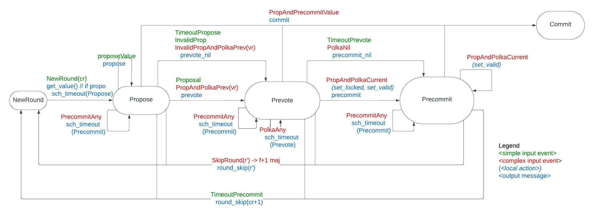

# Malachite Documentation

Malachite is an implementation of the Tendermint consensus algorithm in Rust.
It comes together with an executable specification in Quint. We will use
model-based testing to make sure that the implementation corresponds to the 
specification.

Tendermint consensus works by a set of validator nodes exchanging messages over a
network, and the local consensus instances act on the incoming messages if
certain conditions are met (e.g., if a threshold number of specific messages is
received a state transition should happen). The 
architecture of Malachite separates

- message counting in a *vote book keeper*,
- creating consensus inputs in a *driver*, e.g., if a threshold is reached
- doing the state transition depending on the consensus input in the *state machine*

A detailed executable specification of these functionalities are given in Quint.
In this (English) document we discuss some underlying principles, namely,

- [Message handling](#messages-to-events): How to treat incoming messages. Which messages to store, 
and on what conditions to generate consensus inputs.

- [Round state machine](#consensus-protocol---round-state-machine): How to change state depending on the
current state and a consensus input.


## Messages to Events

The consensus state-machine operates on complex `Event`s that reflect the
reception of one or multiple `Message`s, combined with state elements and the
interaction with other modules.

This document overviews how messages should be handled at different stages of
the protocol.

It is assume that a process is at round `r` of height `h` of consensus, or in
short, at round `(h, r)`.


### Different heights

Messages with heights `h'` with either `h' < h` (past) or `h' > h` (future).

The pseudocode description of the algorithm ignores messages from different
heights.
If we take the same approach in this specification, we have to specify
separately modules responsible to handle those messages.


- Past heights (`h' < h`): the consensus state machine is not affected by such
  messages. However, their reception might indicate that a peer is lagging
  behind in the protocol, and need to be synchronized.
  - In CometBFT's implementation we handle message from the previous height
    (`h' = h - 1`) for the `LastCommit` vote set. This only happens during the
    first step of the first round (`r = 0`) of a height.
- Future heights (`h' > h`): the consensus state machine is not able to process
  message from future heights in a proper way, as the validator set for them is
  not known. However, once the process reaches this height `h'`, those messages
  are _required_ for proper operation. There are two options here:
  1. Buffer a limited amount of such messages
  2. Assume that the communication subsystem (p2p) is able to retrieve (ask for
     retransmission) of them when the process reaches height `h'`.
     Notice that this option implies that processes keep a minimal set of
     consensus messages that enables peers lagging behind to decide a past height.

### Previous rounds

Messages from rounds `(h, r')` with `r' < r`: same height `h` but previous round `r'`.

The consensus state machine requires receiving and processing messages from
previous rounds:

- `PREVOTE` messages can produce a Proof of Lock (POL) `2f + 1 ⟨PREVOTE, h, vr, id(v)⟩`
  needed for accepting `PROPOSAL(h, r, v, vr)` message from the current round,
  where `vr == r' < r` (L28).
- `PRECOMMIT` messages can produce a Precommit quorum `2f + 1 ⟨PRECOMMIT, h, r', id(v)⟩`
  that leads to the decision of `v` at round `r'` (L49).
- `PROPOSAL` messages can be required to match a produced Precommit quorum (L49).
  - Associated full value messages are required to produce the `⟨PROPOSAL, h, r', v, *⟩` event

The production of the enumerated events from previous rounds should be
identical to the production of events from messages from the [current round](#current-round).

### Future rounds

Messages from rounds `(h, r')` with `r' > r`: same height `h` but future round `r'`.

#### Round skipping

The consensus state machine requires receiving and processing messages from
future rounds for enabling the _round skipping_ mechanism, defined as follows
in the pseudocode:

```
55: upon f + 1 ⟨∗, hp, round, ∗, ∗⟩ with round > roundp do
56:   StartRound(round)
```

The current interpretation of this rule is that messages from a round `r' > r`
are received from `f + 1` voting-power equivalent distinct senders.
This means, that at least `1` correct process is at round `r'`.

While this threshold does not need to be adopted (it can be configurable),
messages from a future round should initially have their unique senders counted.
Once the round skip threshold of processes is reached, the corresponding event
should be produced.

#### Limits

The same reasoning applied for messages from [future heights](#different-heights)
applies for messages from future rounds.

Messages from future rounds are _required_ for the proper operation of the
consensus state machine once the process reaches their round `r'`.
There are two options, which can in particular be combined:

1. Buffer a limited amount of such messages, or messages from a limited amount
   of future rounds `r'`
   - In CometBFT's implementation, only messages from round `r' = r + 1` are tracked.
2. Assume that the communication subsystem (p2p) is able to retrieve (ask for
   retransmission) of messages from future rounds when the process reaches round `r'`.
   Since messages from [previous rounds](#previous-rounds) are stored by
   default, peers that have reached the future round `r'` should be able to
   retransmit them.

### Current round

Messages matching the current round `(h, r)` of a process produce most of the
relevant events for the consensus state machine.

### Counting votes

Messages `⟨PREVOTE, h, r, *⟩` and `⟨PRECOMMIT, h, r, *⟩` are generically called votes.
They refer to a round step `(h, r, s)` of consensus, where `s` is defined by
the vote type, either `PREVOTE` or `PRECOMMIT`.

The processing of _individual_ vote messages doesn't produce events relevant for
the consensus state machine.
But when the number of unique vote messages referring to a given round step
`(h, r, s)` reaches a given _threshold_, relevant events are produced;
the produced event depends on the value carried by such votes.

General assumptions regarding vote messages:

- Vote messages are produced, signed and broadcast by a validator, which is its
  *sender*
  - To define whether a vote message for round step `(h, r, s)` is valid, the
    validator set for height `h` must be known.
    The validator set can change over heights, but it is the same within a height.
- To each validator in the validator set of a height `h` is associated a *voting power*
  - Thresholds are computed from the voting power associated to the
    sender of each vote message
- A vote message carries a value: either a reference to a proposed value
  `id(v)`, or the special `nil` value
  - For practical effects, it should be considered that the size of vote
    messages is constant
- Correct validators produce at most one vote message per round step: either
  for a `id(v)` or for `nil`
- Byzantine validators may equivocate and produce multiple distinct vote
  messages for the same round step. Equivocating vote messages differ on the
  value they carry: for  `nil`, `id(v)`, `id(v')`, etc.
  - This possibility constitutes an attack vector. A process must thus restrict
    the number of distinct vote messages from the same sender and referring to
    the same round step that can be stored.

#### `f + 1` threshold

This threshold represents that vote messages referring to a round step were
received from a enough number of unique senders, so that it is guaranteed that
_at least one_ of the senders is a _correct_ validator.

The rationale here is that the cumulative voting power of Byzantine validators
cannot exceed `f`, so that at least one of the considered vote messages must
have been produced by a correct validator.

#### `2f + 1` threshold

This threshold represents that vote messages referring to a round step were
received from a enough number of unique senders, so that it is guaranteed that
_the majority_ of the senders are _correct_ validators.

The rationale here is that the cumulative voting power of Byzantine validators
cannot exceed `f`, so that the subset of considered vote messages that must
have been produced by correct validators have a cumulative voting power of at
least `f + 1`, which is strictly greater than `f`.

## Consensus protocol - round state machine

This document provides an overview of the Tendermint consensus protocol and follows ["The latest gossip on BFT consensus"](#References) and the English and Quint specifications located in the [Specs](../../Specs) directory.

The consensus state-machine operates on complex `Event`s that reflect the
reception of one or multiple `Message`s, combined with state elements and the
interaction with other modules.

### Round state-machine

The state machine represents the operation of consensus at a single `Height(h)` and `Round(r)`.
The diagram below offers a visual representation of the state machine. It shows the input events, using green for simple inputs (e.g. timeouts, porposal)
and red for the complex events (e.g. `ProposalAndPolkaCurrent` is sent to the state machine when a valid proposal and a polka of prevotes have been received).
The actions are shown in italics (blue) and the output messages are shown in blue.



The set of states can be summarized as:

- `NewRound`
  - Initial state
  - Can be used to store messages early received for this round
  - In the algorithm when `roundp < r`, where `roundp` is the node's current round
- InProgress (`Propose`, `Prevote`, `Precommit`)
  - Actual consensus single-round execution
  - In the algorithm when `roundp == r`
- `Commit`
  - Final state for a successful round

#### Exit transitions
The table below summarizes the major state transitions in the `Round(r)` state machine.
The transactions from state `InProgress` consider that node can be at any of
the `Propose`, `Prevote`, `Precommit` states.
The `Ref` column refers to the line of the pseudocode where the events can be found.

| From       | To         | Ev Name                      | Event  Details                                                    | Action                            | Ref |
| ---------- |------------|------------------------------|-------------------------------------------------------------------|-----------------------------------| --- |
| InProgress | InProgress | PrecommitAny                 | `2f + 1 ⟨PRECOMMIT, h, r, *⟩` <br> for the first time             | schedule `TimeoutPrecommit(h, r)` | L47 |
| InProgress | NewRound   | TimeoutPrecommit             | `TimeoutPrecommit(h, r)`                                          | `next_round(r+1)`                 | L65 |
| InProgress | NewRound   | SkipRound(r')                | `f + 1 ⟨*, h, r', *, *⟩` with `r' > r`                            | `next_round(r')`                  | L55 |
| InProgress | Commit     | ProposalAndPrecommitValue(v) | `⟨PROPOSAL, h, r', v, *⟩` <br> `2f + 1 ⟨PRECOMMIT, h, r', id(v)⟩` | `commit(v)`                       | L49 |

#### InProgress round

The table below summarizes the state transitions within the `InProgress` state
of the `Round(r)` state machine.
The following state transitions represent the core of the consensus algorithm.
The `Ref` column refers to the line of the pseudocode where the events can be found.

| From      | To        | Event                                  | Details                                                                                | Actions and Return                                                                                    | Ref |
|-----------|-----------|----------------------------------------|----------------------------------------------------------------------------------------|-------------------------------------------------------------------------------------------------------|-----|
| NewRound  | Propose   | NewRound(proposer)                     | `StartRound` with `proposer(h, r) = p`                                                 | **async `getValue()` and schedule `TimeoutPropose(h, r)`**                                                | L19 |
| NewRound  | Propose   | NewRound(non-proposer)                 | `StartRound` with `proposer(h, r) != p` (optional restriction)                         | schedule `TimeoutPropose(h, r)`                                                                       | L21 |
| **Propose**   | **Propose**   | **ProposeValue(v)**                        | `getValue()` returned                                                                  | broadcast `⟨PROPOSAL, h, r, v, validRound⟩`                                               | L19 |
| Propose   | Prevote   | Proposal(v, -1)                        | `⟨PROPOSAL, h, r, v, −1⟩`                                                              | broadcast `⟨PREVOTE, h, r, {id(v), nil}⟩`                                                             | L23 |
| Propose   | Prevote   | **InvalidProposal**(v, -1)                 | `⟨PROPOSAL, h, r, v, −1⟩`                                                              | broadcast `⟨PREVOTE, h, r, nil⟩`                                                                      | L32 |
| Propose   | Prevote   | ProposalAndPolkaPrevious(v, vr)        | `⟨PROPOSAL, h, r, v, vr⟩` <br> `2f + 1 ⟨PREVOTE, h, vr, id(v)⟩` with `vr < r`          | broadcast `⟨PREVOTE, h, r, {id(v), nil}⟩`                                                             | L30 |
| Propose   | Prevote   | **InvalidProposalAndPolkaPrevious**(v, vr) | `⟨PROPOSAL, h, r, v, vr⟩` <br> `2f + 1 ⟨PREVOTE, h, vr, id(v)⟩` with `vr < r`          | broadcast `⟨PREVOTE, h, r, nil⟩`                                                                      | L32 |
| Propose   | Prevote   | TimeoutPropose                         | `TimeoutPropose(h, r)`                                                                 | broadcast `⟨PREVOTE, h, r, nil⟩`                                                                      | L57 |
| Prevote   | Prevote   | PolkaAny                               | `2f + 1 ⟨PREVOTE, h, r, *⟩` <br> for the first time                                    | schedule `TimeoutPrevote(h, r)⟩`                                                                      | L34 |
| Prevote   | Precommit | ProposalAndPolkaCurrent(v)             | `⟨PROPOSAL, h, r, v, ∗⟩` <br> `2f + 1 ⟨PREVOTE, h, r, id(v)⟩` <br> for the first time  | update `lockedValue, lockedRound, validValue, validRound`,<br /> broadcast `⟨PRECOMMIT, h, r, id(v)⟩` | L36 |
| Prevote   | Precommit | PolkaNil                               | `2f + 1 ⟨PREVOTE, h, r, nil⟩`                                                          | broadcast `⟨PRECOMMIT, h, r, nil⟩`                                                                    | L44 |
| Prevote   | Precommit | TimeoutPrevote                         | `TimeoutPrevote(h, r)`                                                                 | broadcast `⟨PRECOMMIT, h, r, nil⟩`                                                                    | L61 |
| Precommit | Precommit | PolkaValue(v)                          | `⟨PROPOSAL, h, r, v, ∗⟩` <br>  `2f + 1 ⟨PREVOTE, h, r, id(v)⟩` <br> for the first time | update `validValue, validRound`                                                                       | L36 |

The ordinary operation of a round of consensus consists on the sequence of
round steps `Propose`, `Prevote`, and `Precommit`, represented in the table.
The conditions for concluding a round of consensus, therefore for leaving the
`InProgress` state, are presented in the previous subsection.

##### Validity Checks
The pseudocode of the algorithm includes validity checks for the messages. These checks have been moved out of the state machine and are now performed by the `driver` module.
For this reason:
- `L22` is covered by `Proposal(v, -1) and `InvalidProposal(v, -1)`
- `L28` is covered by `ProposalAndPolkaPrevious(v, vr)` and `InvalidProposalAndPolkaPrevious(v, vr)`
- `L36` and `L49` are only called with valid proposal

TODO - show the full algorithm with all the changes

##### Asynchronous getValue() and ProposeValue(v)
The original algorithm is modified to allow for asynchronous `getValue()`. The details are described below.

<table>
<tr>
<th>arXiv paper</th>
<th>Async getValue()</th>
</tr>

<tr >
<td>

```
function StartRound(round) {
 round_p ← round
 step_p ← propose
 if proposer(h_p, round_p) = p {
  if validValue_p != nil {
   proposal ← validValue_p


  } else {
   proposal ← getValue()

  }


  broadcast ⟨PROPOSAL, h_p, round_p, proposal, validRound_p⟩
 } else {
  schedule OnTimeoutPropose(h_p,round_p) to
   be executed after timeoutPropose(round_p)
 }
}
```

</td>

<td>

```
function StartRound(round) {
 round_p ← round
 step_p ← propose
 if proposer(h_p, round_p) = p {
  if validValue_p != nil {
   proposal ← validValue_p

   broadcast ⟨PROPOSAL, h_p, round_p, proposal, validRound_p⟩

  } else {
   getValue() // async
   schedule OnTimeoutPropose(h_p,round_p) to
     be executed after timeoutPropose(round_p)
  }


 } else {
  schedule OnTimeoutPropose(h_p,round_p) to
   be executed after timeoutPropose(round_p)
 }
}
```

</td>
</tr>
</table>

- New Rule added

<table>
<tr>
<th>arXiv paper</th>
<th>Async getValue()</th>
</tr>

<tr>
<td>

```
```

</td>

<td>

```
upon PROPOSEVALUE (h_p, round_p, v) {
   proposal ← v
   broadcast ⟨PROPOSAL, h_p, round_p, proposal, -1⟩
}
```

</td>
</tr>
</table>


#### Notes
Most of the state transitions represented in the previous tables consider message and
events referring to the node's current round `r`.
In the pseudocode this current round of a node is referred as `round_p`.

There are however exceptions that have to be handled properly:
- the transition `L28` requires the node to have access to `PREVOTE` messages from a previous round `r' < r`.
- the transition `L49` requires the node to have access to `PRECOMMIT` messages from different round `r' != r`.
- the transition `L55` requires the node to have access to all messages from a future round `r' > r`.

## References

* ["The latest gossip on BFT consensus"](https://arxiv.org/pdf/1807.04938.pdf), by _Buchman, Kwon, Milosevic_. 2018.