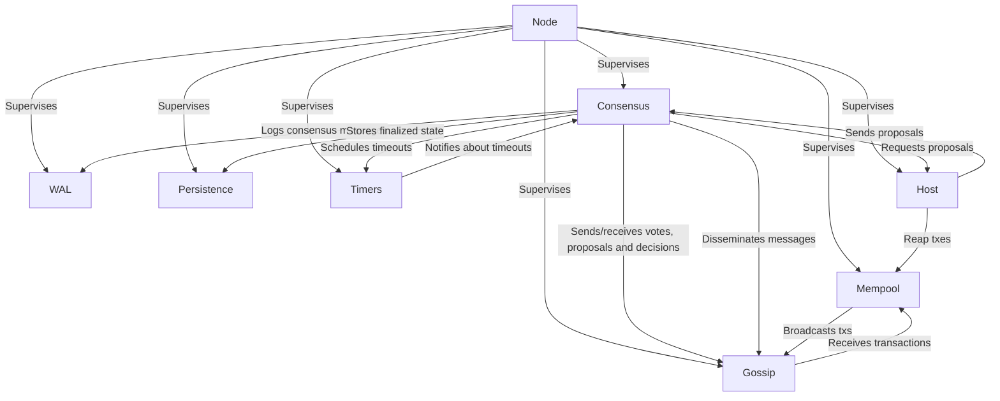

# ADR 002: Architecture of a Consensus Node using an Actor System

## Changelog

* 2024-03-21: First draft

## Context

This Architectural Decision Record (ADR) outlines the architecture of a node for consensus within the Malachite consensus engine, which is implemented in Rust. 
This proposal suggests to use the actor model for designing and building the consensus node. 
The choice of the actor model is motivated by its proven track record in systems such as Erlang and Akka/Pekko, and its great fit with the Rust language's ownership and concurrency model. Moreover, the actor model facilitates building highly concurrent, distributed, and fault-tolerant systems. 

The node will consist of several actors that communicate through message passing only:
- Consensus
- Gossip
- Mempool
- Write-Ahead-Log (WAL)
- Persistence
- Timers
- Host

### Why the Actor Model?

In the actor model, an actor system comprises actors that encapsulate state and behavior. Actors communicate exclusively by sending messages to each other, ensuring that each actor can only affect its state, thus fitting well with Rust's ownership and borrowing rules. This model promotes a clean separation of concerns and simplifies reasoning about system behavior in a concurrent environment.

Erlang's success in building fault-tolerant systems such as telecommunications equipment demonstrates the actor model's viability. Akka, inspired by Erlang, has similarly shown that the model can be effectively applied to the JVM ecosystem for building concurrent applications. Rust's [`ractor`][ractor] framework shows promise in bringing these benefits to the Rust ecosystem, in an idiomatic way.

## Decision

The Malachite node will be implemented as an actor system running the following actors:

### Node Actor

The *Node* actor serves as the top-level actor within the Malachite consensus engine's actor system. It acts as the supervisor for all other actors in the system, including the Consensus, Mempool, Gossip, Write-Ahead-Log, Persistence, Timers, and Host actors. The *Node* actor's primary responsibilities include initializing the system, orchestrating the startup of all subordinate actors, and facilitating communication across actors.

#### Responsibilities

- **System Initialization**: The *Node* actor is responsible for initializing the system. This includes creating instances of all other actors and setting up any necessary initial state or configurations.
- **Fault Tolerance**: As the top-level actor, the *Node* actor monitors subordinate actors for failures and can restart them as needed, preserving the integrity and availability of the consensus engine.
- **Lifecycle Management**: The *Node* actor manages the lifecycle of all actors in the system. It can gracefully shut down actors during system termination or restart actors as part of fault recovery processes.

#### Design Considerations

- **Efficient Message Handling**: The *Node* actor implements efficient message handling and routing mechanisms to minimize latency and ensure that messages are promptly delivered to the appropriate actors.
- **Scalability**: The design of the *Node* actor allows for scalability, both in terms of handling increased message volumes and in facilitating the addition of new actors to the system as needed.
- **Decoupling**: The *Node* actor decouples the various components of the system, allowing for independent development, testing, and scaling of each actor. This separation of concerns enhances the modularity and maintainability of the consensus engine.

> QUESTION: Not clear if we want every single message to be routed through the Node or if actors should communicate directly with each others?

#### Implementation Details

The implementation of the *Node* actor will leverage Rust's concurrency features and the `ractor` framework being used. It will define message types for all inter-actor communication and implement handlers for these message types. 
Care will be taken to ensure that the *Node* actor does not become a bottleneck in the system, employing strategies such as message batching and asynchronous message handling as appropriate.

#### Messages

TBD

### Consensus Actor

#### Responsibilities

- **State Management**: The Consensus actor maintains the state of the consensus algorithm, tracking the current height, round, and step of the algorithm. It ensures that the state transitions adhere to the consensus protocol's rules. 
- **Decision Making**: It evaluates incoming proposals, prevotes, and precommits, making decisions based on the consensus rules. This includes moving to new rounds, locking on proposals, and ultimately deciding on a value for the current height.
- **Vote Coordination**: The actor coordinates the voting process among validators. It initiates voting rounds by sending proposals or votes to the *Node*/*Gossip* (TBD) actor for dissemination and processes incoming votes to advance the consensus protocol.
- **Timeout Management**: Manages timeouts for various stages of the consensus process, signaling the Timers actor to start or stop timers and reacting to timeout notifications.
- **Interaction with Host**: Requests proposals from the *Host* actor when the node is the proposer for a round, and forwards validated proposals to the Gossip actor for dissemination.

#### Design Considerations

- **Modularity and Isolation**: The *Consensus* actor is designed to encapsulate the consensus logic in isolation from networking, persistence, and other concerns. This modularity facilitates easier testing, maintenance, and updates to the consensus logic.
- **Fault Tolerance**: The actor must gracefully handle invalid messages, and should contribute to the system's ability to recover from faults without compromising the safety or liveness of the consensus.
- **Security Considerations**: The actor must validate signatures on incoming messages and prevent double-voting.

#### Implementation Details

- **`Driver` instance**: The *Consensus* actor holds an instance of the Malachite `Driver`, to which it forwards incoming messages (votes, proposals, etc.) and timeout notifications, and reacts to its outputs, driving consensus forward across multiple heights.
- **Integration with `Context`**: The *Consensus* actor integrates the Malachite `Context` for signing votes and verifying signatures, ensuring the integrity and authenticity of messages within consensus.

#### Messages

TBD

### Gossip Actor

#### Responsibilities

- **Network Communication**: Manages all peer-to-peer network communications. This includes sending and receiving messages such as proposals, votes, and consensus decisions to and from other nodes in the network.
- **Message Dissemination**: Ensures the efficient dissemination of consensus-related messages across the network, employing the GossipSub protocol to maximize reach while minimizing network congestion.
- **Peer Management**: Maintains a list of active peers and monitors their status. The actor is responsible for initiating connections to new peers and handling disconnections or failures of existing peers.
- **Fault Detection and Handling**: Implements mechanisms to detect faulty or malicious nodes and mitigates their impact on the network. This may involve throttling, disconnecting, or blacklisting nodes that exhibit undesirable behavior.

#### Design Considerations

- **Scalability**: Designed to efficiently handle a large number of peers and high volumes of message traffic.
- **Robustness and Fault Tolerance**: Implements strategies to maintain network connectivity and message dissemination in the face of node failures, network partitions, and adversarial behavior.
- **Security**: Incorporates security measures to safeguard against common network-level attacks, by validating the authenticity and integrity of incoming messages.
- **Configurability**: Allows for fine-tuning of parameters (TBD). This configurability enables the system to adapt to different network environments and use cases.

#### Implementation Details

- **Gossip Protocol Implementation**: Utilizes a well-designed gossip protocol (GossipSub) to propagate messages throughout the network. The protocol balances the need for rapid dissemination with the goal of minimizing network traffic.
- **Peer Discovery and Management**: Implements peer discovery mechanisms (e.g., using seed nodes or a DHT) to find and connect to other nodes.
- **Message Verification**: Integrates with the Malachite `Context` to verify the signatures of incoming messages, ensuring their authenticity.
- **Rate Limiting and Back-Pressure**: Employs rate limiting and back-pressure techniques to manage incoming and outgoing message flows.
- **Logging and Monitoring**: Provides logging and monitoring capabilities to track the actor's operations and performance.

#### Messages

TBD

### Mempool Actor

#### Responsibilities

- **Transaction Management**: Manages the pool of transactions, receiving both a stream of transactions from the network and transactions submitted to the node.
- **Transaction Broadcasting**: Integrates with the *Gossip* actor for broadcasting valid transactions to other nodes in the network to ensure network-wide transaction availability and redundancy.
- **Integration with Host**: Stream transactions to the *Host* actor for proposal assembly.
- **Duplicate and Spam Filtering**: Implements mechanisms to identify and filter out duplicate transactions and potential spam to protect the system's integrity and prevent DoS attacks.

#### Design Considerations

- **Scalability and Performance**: Optimizes for high throughput and low latency in transaction processing to accommodate high volumes of network activity.
- **Security and Robustness**: Incorporates security measures to mitigate common attack vectors such as transaction spam, replay attacks, and double spending.
- **Resource Efficiency**: Manages memory and computational resources efficiently, implementing strategies such as transaction eviction policies and dynamic resource allocation to balance mempool size with system capabilities.
- **Configurability and Adaptability**: Provides configurable parameters for mempool management, such as size limits, fee thresholds, and transaction expiration times, allowing for dynamic adjustment to changing network conditions.
- **Interoperability with Consensus**: Ensures compatibility and seamless integration with the *Gossip* and *Host* actors, facilitating the streaming of transactions from the mempool to proposal assembly.

#### Implementation Details

- **Network Communication Efficiency**: Designs network communication protocols to minimize overhead and bandwidth usage in transaction broadcasting, employing techniques such as transaction compression, aggregation, and delta broadcasting.
- **Monitoring and Analysis Tools**: Includes tools for monitoring mempool health, transaction throughput, and performance metrics. Supports analysis of transaction patterns, fee trends, and potential bottlenecks for ongoing optimization.

#### Messages

TBD

### Write-Ahead-Log (WAL) Actor

#### Responsibilities

- **Logging**: Ensures that all consensus-related messages and state transitions are logged to disk before being acted upon. This includes proposals, votes, and consensus decisions.
- **Durability Guarantee**: Provides a durability guarantee for the consensus process. In the event of a system crash or failure, the WAL enables the system to recover to a consistent state and resume operation without violating consensus properties.
- **Recovery Support**: Supports the system recovery process by providing the necessary logs to reconstruct the consensus state up to the last known consistent point.
- **Efficiency Optimization**: Optimizes logging performance to minimize the impact on the consensus process latency. Balances the trade-off between write throughput and recovery time.

#### Design Considerations

- **Write Performance**: Implements strategies to enhance write performance to the log, such as batching writes, using efficient serialization formats, and leveraging asynchronous I/O operations. The goal is to minimize the latency impact on the consensus process.
- **Data Integrity and Reliability**: Ensures data integrity and reliability through techniques like checksums, write-ahead logging, and atomic flushes. Protects against partial writes, corruption, and data loss.
- **Log Compaction and Retention**: Supports configurable log compaction and retention policies to manage disk space usage, allowing the pruning of old log entries that are no longer needed.
- **Recovery Efficiency**: Designs the log structure and recovery process to be efficient, minimizing startup time after a failure.

#### Implementation Details

- **Log Structure**: Implements a log structure that supports efficient append operations, checkpointing, and compaction. Entries are timestamped and indexed to facilitate quick access during the recovery process.
- **Asynchronous Logging**: Leverages Rust's asynchronous programming model to perform disk writes without blocking consensus operations. Ensures that logging operations do not unduly delay the consensus process.
- **Serialization and Compression**: Employs efficient serialization techniques and optional compression to reduce the size of logged data, enhancing write performance and reducing disk space requirements.
- **Fault-Tolerant Design**: Incorporates fault tolerance into the logging process, ensuring that the system can recover from errors such as disk full conditions, write failures, and unexpected shutdowns.
- **Monitoring and Alerts**: Includes mechanisms for monitoring log size, write latency, and error rates. Provides alerts for conditions that could impact the health of the consensus process or indicate potential failures.

#### Messages

TBD

#### Implementation Details

### Persistence Actor

#### Responsibilities

- **State Storage**: Manages the persistent storage of the consensus engine's state, including finalized consensus decisions, blockchain state, and any other durable state required by the consensus protocol.
- **Data Retrieval**: Provides mechanisms for the retrieval of stored state, facilitating queries from other actors within the system, such as the Consensus actor needing historical data for validation purposes or the *Node* actor serving data requests from external clients.
- **Transaction Logging**: In addition to consensus decisions, handles the logging of transactions or other data elements that are proposed and eventually included in the finalized state.
- **Snapshot Management**: Implements snapshotting functionality to capture the full state at specific points in time. This aids in efficient state recovery and bootstrap of new or recovering nodes in the network.
- **Data Integrity and Consistency**: Ensures the integrity and consistency of stored data through mechanisms like transactional writes, checksums, and recovery procedures.

#### Design Considerations

- **Scalability and Performance**: Designs storage schemas and indexing strategies that support high-performance reads and writes.
- **Fault Tolerance and Reliability**: Ensures that the storage system is fault-tolerant, capable of recovering from failures without data loss or corruption.
- **State Pruning**: Supports state pruning mechanisms to manage disk space usage, removing data that is no longer needed for consensus or query purposes.
- **Migration**: Designs the persistence layer with data migration in mind, as well as upgrades as the consensus protocol evolves.

#### Implementation Details

- **Database Choice**: Selects an appropriate database system (LevelDB, RocksDB, SquirrelDB, etc.) based on the requirements of the consensus engine, considering the use of embedded databases for simplicity.
- **Data Modeling and Indexing**: Carefully models data and implements indexing strategies that optimize for the query patterns of the consensus engine.
- **Snapshot and Pruning Strategies**: Implements snapshot creation and data pruning logic that balances the need for quick recovery and historical data access against disk space requirements.
- **Monitoring**: Provides mechanisms for monitoring the health and performance of the persistence layer, including disk usage, write/read latency, and error rates.

#### Messages

TBD

### Timers Actor

#### Responsibilities

- **Timeout Management**: Manages timeouts for various stages of the consensus process, such as proposal, prevote, and precommit phases.
- **Dynamic Adjustment**: Supports dynamic adjustment of timeout durations based on consensus state (e.g. increase timeouts in each round).
- **Scalability**: Manages a potentially large number of concurrent timeouts without significant degradation in performance.
- **System Time Changes**: Gracefully handles changes in system time, ensuring that such changes do not cause timeouts to fire at the wrong time.

#### Design Considerations

- **Accuracy vs. Resource Usage**: Balances the need for accurate timeout management with the constraints of resource usage.
- **Configurability**: Allows for the configuration of timeout durations.
- **Isolation from System Clock**: Minimizes dependency on the system clock for timeout management, reducing the impact of system clock adjustments.

#### Implementation Details

- **Event-Driven Notifications**: Utilizes an event-driven model to notify the *Consensus* actor and other relevant actors when timeouts expire. Ensures that timeout expirations are handled promptly and in the correct order.
- **Monitoring and Logging**: Includes monitoring and logging capabilities to track the behavior and performance of the timer management system.
- **Robustness to Time Skews**: Implements mechanisms to handle system time adjustments or skews gracefully. Ensures that such adjustments do not cause missed timeouts.

#### Messages

TBD

### Host Actor

#### Responsibilities

- **Reap Transactions**: Reap transactions from the *Mempool* actor.
- **Proposal Assembly**: Constructs proposals to be considered by the *Consensus* actor.

#### Design Considerations

- **Scalability**: Designs the proposal assembly process to efficiently handle large volumes of transactions and state data. Ensures that the system can scale to support high transaction throughput and large state sizes.
- **Security and Integrity**: Incorporates mechanisms to ensure the security and integrity of proposals, including transaction validation and state proof verification.
- **Flexibility and Configurability**: Allows for flexible configuration of proposal assembly parameters, such as maximum proposal size and transaction selection criteria.
- **Interoperability with Consensus**: Ensures seamless integration with the *Consensus* actor, providing proposals within a timeframe that aligns with the consensus algorithm's requirements.

#### Implementation Details

- **Asynchronous Operation**: Leverages Rust's async/await model to perform proposal assembly concurrently, without blocking other consensus activities. Ensures that proposal assembly can proceed in parallel with consensus.
- **Monitoring and Metrics**: Includes monitoring and metrics collection for the proposal assembly process.

## Consequences

### Positive

- The actor model inherently supports building highly concurrent and fault-tolerant systems, which are essential attributes for a consensus engine.
- By encapsulating functionality within actors, the system promotes a clean separation of concerns, making the system easier to reason about, extend, and maintain.
- The actor model fits well with Rust's ownership and concurrency model, allowing the system to leverage the language effectively, without running into typical problems with shared (mutable) ownership, such as use of locks or excessive cloning.

### Negative

- For developers unfamiliar with the actor model, there may be an initial learning curve.
- Introducing an actor system can add overhead and complexity, particularly in terms of structuring an algorithm using message passing as well as actor lifecycle management.

### Neutral

- Defining actors with the `ractor` framework incur a little bit of boilerplate compared to plain tasks, but provides us with supervision capabilities out of the box, which we would have to write ourselves otherwise.
- The choice of an actor model does not preclude the use of other concurrency models where they might offer specific advantages, allowing for a hybrid approach where appropriate. For instance, while inherently discouraged, nothing prevents us from using sharing mutable state protected by a mutex between actors for performance reasons.

## Appendix

### Architecture Diagram

### Actor Model vs Task-based Concurrency

#### Actor Model

**Pros:**
- **Isolation and Encapsulation:** Actors maintain their state in isolation from other actors, reducing the risks of shared-state concurrency issues. This encapsulation aligns well with Rust's principles of ownership and borrowing.
- **Fault Tolerance:** The hierarchical nature of actors (where actors can supervise and restart their children) supports building systems that can gracefully recover from failures.
- **Clear Communication Patterns:** The explicit message-passing interface between actors can lead to more predictable and maintainable code, especially in complex systems with many interacting components.

**Cons:**
- **Messaging Overhead:** Communicating exclusively through messages can introduce overhead, particularly in terms of latency and throughput, when compared to direct calls or shared memory access in a single-threaded context.
- **Complexity in Debugging and Reasoning:** The asynchronous nature of message passing and actor interactions can make systems harder to debug and reason about, especially when tracking down the source of errors or understanding message flows.

### Task-based Concurrency with Async/Await

Task-based concurrency in Rust, using async/await and futures, focuses on executing asynchronous tasks that can efficiently wait for resources or other tasks to complete, minimizing idle CPU time.

**Pros:**
- **Direct Control and Flexibility:** Developers have fine-grained control over task execution, including when tasks yield control and how resources are allocated, enabling optimizations that might not be as straightforward in an actor-based system.
- **Simpler for Certain Use Cases:** For applications with straightforward asynchronous operations, task-based concurrency can lead to simpler and more direct code compared to setting up an actor system.

**Cons:**
- **Shared State Challenges:** Managing shared state across tasks requires careful attention to Rust's ownership and borrowing rules, which can be complex in highly concurrent scenarios.
- **Error Handling Complexity:** Propagating and handling errors across asynchronous tasks and futures can sometimes be more cumbersome than in synchronous code or within the encapsulated environment of an actor.
- **Cognitive Load:** Understanding the execution model and lifetimes in asynchronous Rust requires a solid grasp of async/await semantics, which can add to the cognitive load for developers.

## References

* [Ractor - Rust Actor Framework][ractor]
* [Erlang - Official Website](https://www.erlang.org/)
* [Akka - Official Documentation](https://akka.io/docs/)
* [Apache Pekko - Official Documentation](https://akka.io/docs/)
* ["The latest gossip on BFT consensus"](https://arxiv.org/pdf/1807.04938.pdf)

[ractor]: https://docs.rs/ractor
