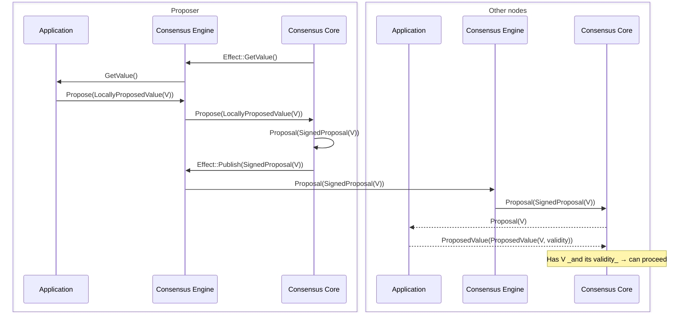
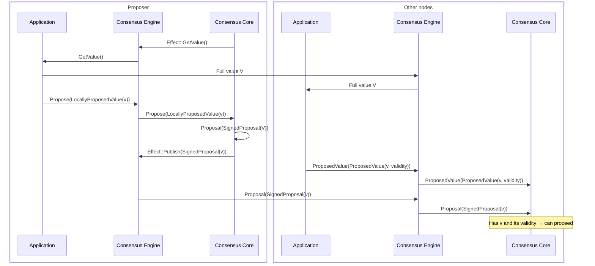
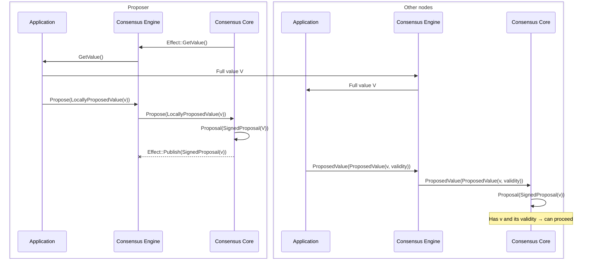

# ADR 003: Propagation of Proposed Values

## Changelog

* 2025-03-18: Context and description of the problem
* 2025-03-21: Current design description
* 2025-03-25: Diagrams and more detailed description of the three modes of operation
* 2025-03-26: Reviewed & accepted

## Overview

This ADR documents the current architecture adopted in Malachite
for handling the propagation of proposed values.
The main goal of this architecture is to
enable flexibility for application developers.
The architectural choice applies both to the core libraries
as well as to the engine.

Propagation of proposed values among system nodes is often critical for
system performance. Hence, allowing different optimizations and modes of
propagation is an important architectural requirement for Malachite.

Malachite supports three modes for value propagation:
* `ProposalOnly`
* `PartsOnly`
* `ProposalAndParts`

Their respective use-case and design are documented in the following sections.

## Context

Malachite implements a consensus algorithm, [Tendermint][consensus-spec],
which allows nodes to agree on a single *decision value* for each
consensus instance or *height*.

The software on top of Malachite provides the possible decision values;
in this document, this is referred to as the *application*.
There are no assumptions in the consensus algorithm about what a **value** represents, the application provides the semantics.
For example, in blockchain applications, input values are blocks proposed to be appended to a blockchain.

Similarly, the consensus algorithm makes no assumptions about the **size**
of proposed values; they may be of arbitrary byte size. However,
the application is expected to define a maximum size for proposed values
and to configure the consensus parameters accordingly—most notably,
the durations of consensus timeouts.

When value size becomes a relevant factor, it is important to recognize
that the consensus process comprises two distinct stages:

* **Value Propagation**: Proposed values must be transmitted to all consensus participants, eg system nodes.
* **Value Decision**: The consensus algorithm selects and decides on one of the successfully propagated values.

The cost of **Value Propagation**, in terms of latency and bandwidth,
clearly depends on the size of the proposed values. In contrast, the
**Value Decision** stage is in principle independent of value size and
incurs roughly a constant cost from the perspective of values.

In the original, abstract Tendermint algorithm, the `PROPOSAL` message performs
the task of **Value Propagation**. The proposer node broadcasts this message, which
includes the proposed value `v`. As the present ADR will show, different implementations
can achieve this abstract task.

The **Value Decision** phase involves `PREVOTE` and `PRECOMMIT`
messages—collectively referred to as *votes*. Each vote includes
either an identifier `id(v)` of the proposed value `v` or the
special value `nil`. The function `id(v)` provides a compact
representation of `v`, typically implemented as a fixed-size hash.

### Problem statement

From the above, it can be observed that **Value Propagation** is more challenging,
as it involves disseminating potentially large amounts of data in
the network of system nodes. In contrast, the **Value Decision** phase requires only
the transmission of vote messages, which are relatively small and of
constant size.

Because value propagation can be a bottleneck, Malachite's consensus API has to provide enough flexibility so that applications can optimize the value propagation stage.

### ADR scope

This ADR documents the design of the Malachite consensus API relevant for
the **Value Propagation** stage. Specifically, how Malachite enables
application builders flexibility for bypassing or mitigating the performance
implications of dealing with value propagation in a large system of nodes.

## Decision

### Building Blocks

There are a number of entities that are involved in the value propagation process:

* **Application:** The software that uses the consensus engine. It is responsible for:
  * Providing the value to be propagated
  * Validating received values
  * Providing data availability for values (both undecided and decided)
* **Consensus Engine:** The component responsible for managing the interactions between the consensus core and the application, and between the consensus core and the networking layer. For the ones involved in the value propagation process, the consensus engine is responsible for:
  * Propagating values and/or proposals via the networking layer
  * Receiving values and/or proposals from the networking layer
  * Relaying proposals to the consensus core
  * Relaying values to the application
* **Consensus Core:** The component in Malachite that implements the Tendermint consensus protocol.
* **Networking:** The component responsible for transmitting messages between nodes (not shown in the diagrams below).

Malachite provides implementations for the consensus core, engine and networking. Applications can integrate with Malachite via various interfaces:

* Consensus core - See [ADR-004][adr-004]
* Engine without networking - [Snapchain](https://github.com/farcasterxyz/snapchain)
* Engine with networking (channel-based) - [Example application](https://github.com/informalsystems/malachite/tree/main/code/examples/channel)
* Engine with networking (actor-based) - [Starknet test application](https://github.com/informalsystems/malachite/tree/main/code/crates/starknet)

#### Changes to Tendermint

Malachite deviates from the [vanilla Tendermint consensus][tendermint-code] in these two key methods, relate to proposal propagation and validation:

* `getValue()` is asynchronous and the propose timeout is passed as a parameter in order to let the value (`v`) builder know how long it has to create it. See [Malachite async GetValue][getvalue-changes] for more details.
* `valid(v)` is checked when a `PROPOSAL` is available but before the algorithm runs. This is equivalent in a way with `PROPOSAL(h, r, v, vr, valid)` where `valid = {true | false}` with `valid(v)` already checked. See [Malachite validity checks][validity-changes] for more details.

### Value Payload Modes

At the moment, the Malachite core consensus library supports three
different modes of operation to handle value propagation:

1) **ProposalOnly**
2) **PartsOnly**
3) **ProposalAndParts**

A specific mode can be set as a `value_payload` consensus parameter:

```rust
/// Consensus parameters.
#[derive_where(Clone, Debug)]
pub struct Params<Ctx: Context> {
    ...

    /// The messages required to deliver proposals
    pub value_payload: ValuePayload,

    ...
}
```

In the following sections, for each of the three modes of operation, the consensus core interactions with the environment are described.

In general, events from the environment may trigger different inputs to the consensus core, and a complete overview of all inputs can be found in [ADR-004 Coroutine-Based Effect System for Consensus][adr-004].

This documents focuses on the core consensus inputs related to value propagation.

| **Input** | **Fields** | **Description** |
|-----------|------------|-----------------|
| `Proposal (SignedProposal<Ctx>)` | `height`, `round`, `value`, `value_origin` | This input is generated and passed to consensus core when a proposal message is received from the network. |
| `Propose (LocallyProposedValue<Ctx>)` | `height`, `round`, `value` | This input is produced by the application in response to a request (`getValue()` specifically) for a value to propose. |
| `ProposedValue (ProposedValue<Ctx>, ValueOrigin)` | `height`, `round`, `valid_round`, `proposer`, `value`, `validity` | This input is also generated by the application when the application is responsible for disseminating values through the network. It informs the consensus core that a proposed `v` value has been received and validated (`valid(v)`). |

When processing each of these inputs, the consensus core may produce various effects that must be handled by the "environment" to fully process the input. All the effects produced by the consensus core are described in more detail in [ADR-004][adr-004]. These are especially relevant if the application integrates directly with the consensus core. Malachite offers a "Consensus Engine" crate that can be used as an integration point. Regardless the of the type of integration, the "Consensus Engine" is shown in this document as the part of the "environment" that handles the effects, relays messages between consensus core and the application, etc.

Here, the focus is limited to interactions related to value propagation and how they
differ depending on the selected mode of operation. Towards this goal, in the following sections, the `height` , `round`, `valid_round`, and `value_origin` fields are omitted from the inputs.

### Possible value types for Consensus Core?

The concrete value type is defined by the context `Ctx` and is passed to consensus as a type parameter. Each application using Malachite will define its own concrete value type.
The value type must implement the `Value` trait, including the `id()` method. Consensus core uses the `id()` when generating the votes.

The following notations are used in the following sections:

* `V` denotes the full application value, this for example can be a block in a blockchain application
* `v` is a short representation of the value `V`, it may be for example the hash of the value.

### ProposalOnly

> [!WARNING]
> This mode is under development and not yet fully supported in Malachite (see the dotted lines in the diagram).

This approach most closely follows the original Tendermint algorithm.

It is expected to be used by applications that have small values to propose. The maximum value size is defined by the p2p network configuration. For example, if libp2p gossipsub is used, this will be the `max_transmit_size` configured for the gossipsub protocol.

To reduce the size of the vote messages it is expected that `id(V)` method implementation returns a short representation of the proposed value `V`.



In this mode, the consensus core generates the `GetValue()` effect to request a value from the application. The application responds by sending the `Propose(LocallyProposedValue(V))` input to the consensus core.

The consensus core then generates a `Proposal(SignedProposal(V))` message that includes the actual
value `V` received via `LocallyProposedValue(V)`, and generates a `Publish`
effect. This effect is handled by the consensus engine, and the proposal,
with the full value embedded in it, is disseminated through the network.

Upon receiving a `Proposal(SignedProposal(V))` message from the network, the engine passes it directly to the consensus core for processing.
Consensus core verifies the proposal is properly signed by the Proposer for the current height and round.

*(Implementation in progress) The consensus engine implementation should also pass the unsigned `Proposal(V)` message to the application for validation.
Once validation is performed the application generates the `ProposedValue(V, valid(V))` input and provide it as input to consensus.*

In this mode, the application only needs to provide a value to the consensus core through `Propose(LocallyProposedValue(V))`, and value propagation is entirely handled by the networking module. The consensus core processes proposal messages that already contain the proposed value `V`.

This mode is the simplest, as the application is only responsible for providing the value to be ordered. However, if the value is large, the resulting proposal messages will also be large and must be propagated as such through the network. Any optimizations for value propagation, such as chunking the value into smaller parts and reassembling it on the receiving side, must be implemented outside the consensus core. This is because both the consensus and application remain unaware of how the value is transmitted.

The other two modes of operation are designed to support such optimizations at the application level rather than at the network level. 
The following sections describe how this is achieved.

### ProposalAndParts

In this mode of operation, the application is responsible to define and implement the dissemination protocol for the full value `V` and its metadata (`height`, `round` and possibly `valid_round`). It is expected that the application splits the value `V` into parts, signs each part individually, and disseminates them throughout the network. At the receiving end, the application should verify that the parts are properly signed by the Proposer for the `height` and `round` as derived from the parts and reassemble the full value `V`.
The application communicates to consensus that a value is available using a reference `v` to `V`.
`v` is expected to be short representation of `V` and a possible (but not mandatory) implementation for  the`id()` trait is the trivial `id(v) = v`.

In order to handle restarts, the application should persist the both the produced and received values `V`.



In this mode, as a response to `GetValue()`, the application generates `Propose(LocallyProposedValue(v))` input that does not contain the full value `V`, but instead carries a value reference `v`.
As a result, the `Proposal` message generated by consensus upon processing this input includes only the value reference,
not the full value. Nevertheless, in this mode, the consensus core generates the `Publish` effect and the `Proposal(SignedProposal(v))` message is disseminated through the network via networking module.

When a node receives the `Proposal(SignedProposal(v))` message it passes it to the consensus. However, in this mode, receiving a proposal alone is not sufficient for the consensus core to consider the proposal complete. The consensus core must also receive confirmation from the application that the corresponding full value is available and was validated.

This confirmation is delivered via the `ProposedValue(ProposedValue(v, validity))` input, which the application generates upon receiving the full value through the network. Only when the consensus core has both `Proposal(SignedProposal(v))` and `ProposedValue(ProposedValue(v, validity))` inputs, it can consider the proposal complete.

### PartsOnly

In this mode of operation, the application is responsible to define and implement the dissemination protocol for the full value `V` and its metadata (`height`, `round` and `valid_round`). It is expected that the application splits the value `V` into parts, signs each part individually, and disseminates them throughout the network. At the receiving end, the application should verify that the parts are properly signed by the Proposer for the `height` and `round` as derived from the parts and reassemble the full value `V`.
The application communicates to consensus that a value is available using a reference `v` to `V`. `v` is expected to be short representation of `V` and a possible (but not mandatory) implementation for `id` is `id(v) = v`.

In addition the consensus implementation does not produce and publish a `Proposal` message.
The reason is that all the information that would be carried in such a message can be derived from `V` and its metadata.
In other words, the application is able to reconstruct the `Proposal` message from the disseminated data, thus rendering the consensus-level `Proposal` message redundant.



This mode is very similar to `ProposalAndParts` but the difference is that when receiving
`Propose(LocallyProposedValue(v))` , and after processed by the consensus core state machine,
the `Publish` effect is not emitted and a `Proposal` message is not sent through the network.

At the receiving side, consensus core waits to receive `ProposedValue(ProposedValue(v, validity))` input and when this happens it considers the proposal as complete and proceeds. The application generates this input upon receiving the full value `V` from the network. As a result, in this case value propagation is totally delegated to the application.

### Value Restreaming

When operating in either `ProposalAndParts` or `PartsOnly` mode, there are situations where the proposer must re-propose a value observed in a previous round. This scenario arises when implementing line 16 of the Tendermint algorithm, where the proposer enters a new round already holding a valid value from an earlier round. 

> **Note:** The application is responsible for storing all previously received propagated values from earlier rounds to support such re-proposals.

The restreaming flow mirrors the initial proposal flow, with the following key differences:

1. **Proposer Node Behavior**:
   - Instead of invoking `GetValue()`, the consensus core emits a `RestreamProposal()` effect, signaling the application to re-disseminate an existing value rather than generating a new one.
   - The application is responsible for re-disseminating the parts of the value across the network.
   - The consensus core does not wait for a `Propose(LocallyProposedValue(v))` input, as it already holds a valid value from the previous round.

2. **Other Node Behavior**:
   - In `ProposalAndParts` mode, if a non-proposer node has already validated the value in a previous round, it can skip waiting for the `ProposedValue(ProposedValue(v, validity))` input, and proceed as soon as it receives the `Proposal(SignedProposal(v))` message.


### Summary

To sum up, different modes rely on different inputs to achieve the same effect as
the original Tendermint algorithm achieve via the `PROPOSAL` message.

* In `ProposalOnly` and `ProposalAndParts`, both `Proposal(SignedProposal(x))` and `ProposedValue(ProposedValue(x, validity))` inputs are needed, with `x == V` for the former and `x == v` for the latter.
* In `PartsOnly`, only `ProposedValue(ProposedValue(v, validity))` input is enough, as no explicit proposal message is sent over the network.
In other words, the Proposal propagation role is entirely up to the application.

Regardless of the mode of operation, the value that consensus operates at the proposal level is defined by the application in the `Value` trait concrete implementation.
The mode of operation is used outside the consensus driver and state machine in order to decide whether to send or accept explicit `Proposal` messages to the caller (via `Effect`).

### `TimeoutPropose`

An important consideration is that, regardless of the mode of operation, all inputs required to complete a
proposal must be received by the consensus before `timeoutPropose` expires. This timeout must be configured
to accommodate for the time needed for a complete value production and propagation. This is especially important
in cases where the value is large and requires longer to be propagated through the network.

## Additional considerations about value propagation

This section presents a (possibly not comprehensive) list of approaches to
handle **Value Propagation** for consensus protocols in general, and for
Tendermint in particular, discussing the pros and cons of each of them.

### Consensus by Value

In this approach, the consensus protocol itself handles the dissemination 
of the actual full value `V` that will eventually be delivered by the application.

The proposer broadcasts a `PROPOSAL(h, r, v, vr)` message, where the field `v` contains 
the full value `V`. Other processes learn the full value by receiving this `PROPOSAL` message. 
Since subsequent vote messages (`PREVOTE`, `PRECOMMIT`) include only a compact identifier `id(v)`, 
a process must first receive the full value `v` through the `PROPOSAL` before it can cast a vote.

When the consensus round succeeds, the protocol delivers the value `v` from the `PROPOSAL` message 
to the application as the decided value for that height.

This mode tightly couples value dissemination with consensus: the protocol allows progress only on 
values that all participants have received, since each process must obtain the full value `v` before 
voting on `id(v)`.


#### Relevance to present ADR

Malachite follows this approach in [`ProposalOnly` mode](#proposalonly), 
when the application returns the full value directly in `Propose(LocallyProposedValue<Ctx>)`.

> [!WARNING]
> As mentioned in the [ProposalOnly](#proposalonly) section, this mode is under development and not yet fully supported in Malachite.

### Consensus by Reference

In this approach, the value disseminated by the consensus protocol is not 
the actual full value `V`, but a *reference* to it—such as a hash or identifier `v`. 
The responsibility of propagating the full value `V` is delegated to the application 
or an external component.

Here, the `PROPOSAL(h, r, v, vr)` message carries only the reference `v`,
not the full value `V`. To propose a value, a process must:
1. Disseminate `V` to other nodes through a separate mechanism (e.g., application layer), and
2. Provide the reference `v` to the consensus protocol for inclusion in the `PROPOSAL`.

On the receiving side, a process that gets a `PROPOSAL` carrying reference `v` 
must *ensure* that the corresponding value `V` is available before voting for
the proposal. Importantly, consensus does *not* need to have 
the full value `V` locally in order to proceed—only assurance that the full value 
is available or will be available when required. 

Since consensus proceeds on references rather than values, the benefit of encoding 
votes with `id(v)` becomes less significant, as `v` is already a compact identifier.

If the consensus round succeeds, the value `v` is what is decided at the consensus layer. 
However, the actual value delivered to the application is the corresponding full 
value `V` that `v` refers to.

#### Relevance to present ADR

Malachite, in `ProposalAndParts` and `PartsOnly` modes, represent a variant of this approach. 
In these modes, the responsibility for disseminating full values is entirely delegated to 
the application. When the application provides a `ProposedValue(v)`, it signals to the 
consensus layer that it possesses the full value `V` corresponding to the reference `v`, 
allowing the consensus logic to proceed safely.

Since value dissemination is not handled by the consensus protocol but explicitly by the application, 
the consensus module only decides on the reference `v` and informs the application of this decision. 
It is then the application's responsibility to match `v` to the full value `V` and deliver `V` accordingly.

## Status

Accepted and implemented as of `ec9c421` (March 2025).

## Consequences

### Positive

* The three modes **ProposalOnly**, **PartsOnly**, and **ProposalAndParts** provide application builders with flexibility

### Negative

* Codebase and interactions may be complex or difficult to understand.

### Neutral

## References

* [Tendermint consensus specification][consensus-spec]
* [Malachite async GetValue][getvalue-changes]
* [Malachite validity checks][validity-changes]
* [ADR 001 - Architecture][adr-001]
* [ADR 004 - Coroutine-Based Effect System for Consensus][adr-004]

[consensus-spec]: ../../specs/consensus/README.md
[tendermint-code]: ../../specs/consensus/pseudo-code.md
[getvalue-changes]: ../../specs/consensus/design.md#asynchronous-getvalue-and-proposevaluev
[validity-changes]: ../../specs/consensus/design.md#validity-checks
[adr-001]: ./adr-001-architecture.md
[adr-004]: ./adr-004-coroutine-effect-system.md
