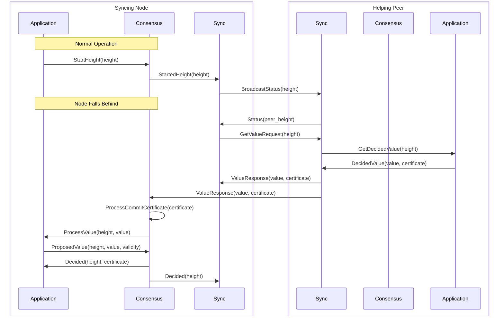

# ADR 005: Value Sync Protocol

## Changelog
* 2024-03-21: Initial version

## Context

The value sync protocol is an important component of the Malachite consensus system that ensures all nodes maintain a consistent view of the blockchain. It handles the synchronization of decided values between nodes, particularly when nodes fall behind or need to catch up to the network's current state.

The protocol needs to:
1. Efficiently sync decided values between nodes
2. Integrate with the consensus engine and application layer
3. Provide metrics and monitoring capabilities
4. Ensure reliable delivery of values

## Decision

The value sync protocol has the following components and interactions:

### Core Components

**Sync Module** (`code/crates/sync`)
   - Handles value synchronization
   - Performs peer management and status tracking
   - Implements request/response protocol for sync operations
   - Provides metrics for monitoring sync operations

**Network Layer** (`code/crates/network`)
   - Handles P2P communication
   - Manages peer connections and discovery
   - Provides reliable message delivery

**Consensus Engine** (`code/crates/core-consensus`)
   - Coordinates with sync protocol for value synchronization

**Application Layer** (example in `examples/channel`)
   - Provides decided values to sync protocol
   - Handles value storage and retrieval
   - Implements synced value validation and processing

### Sync Module

The sync module maintains the following state:

**Height Tracking**
   - `tip_height`: The height of the last decided value
   - `sync_height`: The height currently being synced
   - `started`: Boolean indicating if consensus has started

**Peer Management**
   - `peers`: Map of connected peers and their status
   - Each peer status contains:
     - `peer_id`: Unique identifier for the peer
     - `tip_height`: The peer's last decided height
     - `history_min_height`: Earliest height available from the peer

**Request Tracking**
   - `pending_decided_value_requests`: Map of height to peer for pending value requests
   - Used to track ongoing sync requests and prevent duplicate requests
   - The pending request is removed once a response is received, regardless of the value validity
   - If consensus decided on that value, a `Decided` event will be seen later
   - If no decision is made, sync will retry to get the value from a different peer

**State Transitions**
   - On `StartedHeight`: Updates `sync_height` and `tip_height`, initiates value request if a peer is ahead
   - On `Decided`: Updates `tip_height` and removes pending requests
   - On `Status`: Updates peer information and triggers sync if needed
   - On `Tick`: If there are no pending requests and a peer is ahead, initiates a new value request

### Protocol Flow

The value sync protocol operates between two nodes: a syncing node that needs to catch up and a helping peer that provides the values. The flow consists of two main phases:

**Normal Operation**: During normal operation, nodes periodically broadcast their status to inform directly connected peers about their current height. This helps peers detect when a node falls behind or when other nodes are ahead.

**Catch-up Phase**: When a node detects it has fallen behind (by receiving a status with a higher height), it initiates the synchronization process:
   - Requests the missing value from a peer which is selected randomly from the list of all peers at higher height
   - The peer retrieves the value from its application layer
   - The value is sent back with its commit certificate
   - The syncing node processes the value through consensus and application layers
   - If processed successfully, the node moves to the next height
   - Otherwise, synchronizing the same height is retried

For more details about the underlying protocols and design decisions, see [Protocol Details](#protocol-details).

The sequence diagram below illustrates the message flow between components during a successful value synchronization:

### Protocol Details

**Request/Response Protocol**
The value sync protocol uses [libp2p's request-response protocol](https://github.com/libp2p/rust-libp2p/blob/v0.55.0/protocols/request-response/src/lib.rs) for reliable communication between peers. This protocol ensures:
- A connection exists between peers before sending requests, or
- Automatic dialing to establish connections when needed
- Proper handling of timeouts and failures

**Status Message Broadcasting**
Status messages are broadcast using [libp2p-scatter](https://github.com/romac/libp2p-scatter), a direct peer broadcast mechanism without message forwarding. This design choice is intentional because:
- It ensures that if a node needs to request values based on a received status message, the request is guaranteed to succeed since the peer is directly connected or a connection can be made.
- Avoids potential issues where nodes might receive status updates from non-connected peers they cannot reach
- Maintains a clear relationship between status updates and the ability to request values

## Status

Accepted

## Consequences

### Positive

**Efficient Synchronization**
   - Nodes can catch up when lagging behind
   - Minimizes bandwidth usage through targeted requests

**Reliable Operation**
   - Handles network failures and timeouts
   - Provides retry mechanisms for failed requests

**Monitoring and Debugging**
   - Comprehensive metrics for sync operations
   - Detailed logging for troubleshooting
   - Performance tracking capabilities

**Flexible Integration**
   - Clean separation between sync, consensus, and application layers
   - Easy to extend for new features
   - Well-defined interfaces between components

### Negative

**Latency Impact**
   - Sync operations may temporarily impact consensus performance
   - Need to balance sync speed with network load

## References

* [Malachite Consensus Documentation](/docs/consensus.md)
* [Channel Example Implementation](/examples/channel)
* [Sync Protocol Implementation](/code/crates/sync)
* [libp2p Request-Response Protocol](https://github.com/libp2p/rust-libp2p/blob/v0.55.0/protocols/request-response/src/lib.rs)
* [libp2p-scatter](https://github.com/romac/libp2p-scatter)
* [libp2p Gossipsub](https://github.com/libp2p/rust-libp2p/tree/master/protocols/gossipsub) 