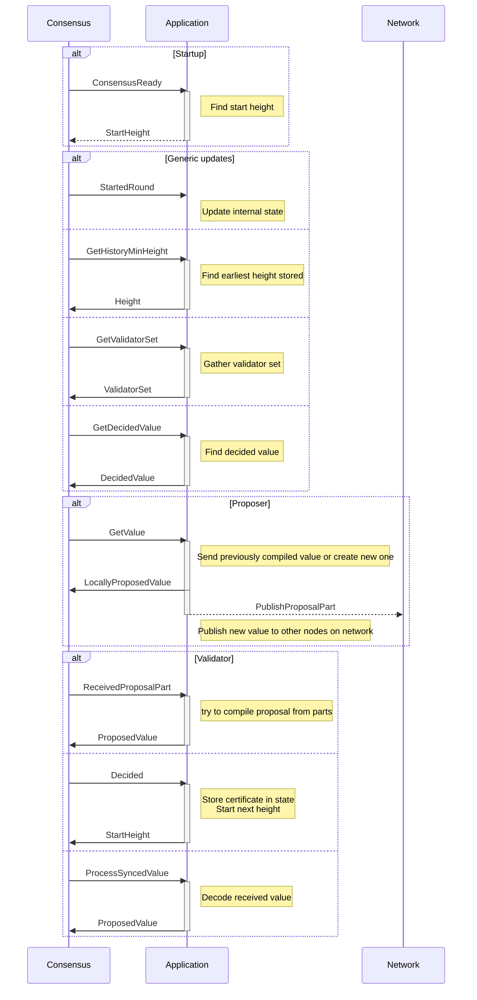

# Write an in-process Malachite application

<!-- TOC start (generated with https://github.com/derlin/bitdowntoc) -->

## Table of contents
- [Introduction](#introduction)
- [Naming](#naming)
- [Prerequisites](#prerequisites)
- [Concepts](#concepts)
   * [The `malachitebft-app-channel` crate](#the-malachitebft-app-channel-crate)
   * [The `Context` trait](#the-context-trait)
   * [Consensus types](#consensus-types)
   * [The `Codec` trait](#the-codec-trait)
   * [The `Node` trait](#the-node-trait)
   * [Messages from consensus to the application](#messages-from-consensus-to-the-application)
   * [Application state](#application-state)
- [Putting it all together](#putting-it-all-together)
   * [Create a new Rust project](#create-a-new-rust-project)
   * [Application state](#application-state-1)
   * [Handle consensus messages](#handle-consensus-messages)
   * [The consensus dialog](#the-consensus-dialog)
   * [Command-line interface](#command-line-interface)
   * [Logging](#logging)
   * [Creating an instance of the `Node` trait](#creating-an-instance-of-the-node-trait)
   * [Starting our application from `main`](#starting-our-application-from-main)
- [Run a local testnet](#run-a-local-testnet)

<!-- TOC end -->


## Introduction
In this tutorial we will build an example validator application using the Malachite libraries. The focus is
integration with the Malachite consensus engine using [Tokio](https://tokio.rs) channels.

## Naming
While Malachite is comprised of several crates whose name start `informalsystems-malachitebft-`,
in this document we will use a shortened prefix `malachitebft-`, thanks to Cargo's ability
to expose a dependency under a different name than the one derived from its crate name.
More about this in the [Putting it all together](#putting-it-all-together) section.

## Prerequisites
The tutorial assumes basic knowledge of asynchronous programming in Rust using the Tokio library.
The beginner Rust knowledge is essential, the asynchronous programming knowledge is recommended.

The tutorial assumes basic distributed systems knowledge, for example: what is a validator, what is a Proof-of-Stake consensus engine.

Knowledge of [CometBFT](https://cometbft.com) or other Byzantine-fault tolerant consensus engines may help with
understanding the consensus engine concepts, however it is not required.

## Concepts
Before going any further, the reader might want to go over the [`ARCHITECTURE.md`](/ARCHITECTURE.md) document
for background information on Malachite and the ideas behind its architecture.

We can now get familiar with the concepts pertaining to building an application for Malachite.

### The `malachitebft-app-channel` crate
An example application will require only a few of the Malachite crates. The `malachitebft-app-channel` crate has all the
necessary components for building an application that interacts with the consensus engine through Tokio channels.
The crate also re-exports the necessary types and traits from the `malachitebft-app` crate under
`malachitebft_app_channel::app` for easier consumption.

### The `Context` trait

Because Malachite is a generic implementation of BFT consensus engine, it endeavours to make as few assumptions
as possible about the concrete data structures it uses, and leaves their implementation up to the application.

In order to do that, the `Context` trait provides an abstraction over the various data types used in the engine.
It is defined in `malachitebft_app_channel::app::types::core::Context` and an example implementation can be seen at
`malachitebft_test::Context`.

```rust
pub trait Context
where
    Self: Sized + Clone + Send + Sync + 'static,
{
    /// The type of address of a validator.
    type Address: Address;

    /// The type of the height of a block.
    type Height: Height;

    /// The type of proposal part
    type ProposalPart: ProposalPart<Self>;

    /// The interface provided by the proposal type.
    type Proposal: Proposal<Self>;

    /// The interface provided by the validator type.
    type Validator: Validator<Self>;

    /// The interface provided by the validator set type.
    type ValidatorSet: ValidatorSet<Self>;

    /// The type of values that can be proposed.
    type Value: Value;

    /// The type of votes that can be cast.
    type Vote: Vote<Self>;

    /// The signing scheme used to sign consensus messages.
    type SigningScheme: SigningScheme;

    /// The signing provider used to sign and verify consensus messages.
    type SigningProvider: SigningProvider<Self>;

    // ...
}
```

The application is expected to instantiate this `Context` trait with concrete types for the abstract type definitions above.
Each of these concrete will need to implement the corresponding trait, which can be found on the right-hand side of the
type definition.

The `Context` also defines a few abstract methods which need to be implemented:

```rust
pub trait Context {
    // ...

    /// Select a proposer in the validator set for the given height and round.
    fn select_proposer<'a>(
        &self,
        validator_set: &'a Self::ValidatorSet,
        height: Self::Height,
        round: Round,
    ) -> &'a Self::Validator;

    /// Get the singing provider.
    fn signing_provider(&self) -> &Self::SigningProvider;

    /// Build a new proposal for the given value at the given height, round and POL round.
    fn new_proposal(
        height: Self::Height,
        round: Round,
        value: Self::Value,
        pol_round: Round,
        address: Self::Address,
    ) -> Self::Proposal;

    /// Build a new prevote vote by the validator with the given address,
    /// for the value identified by the given value id, at the given round.
    fn new_prevote(
        height: Self::Height,
        round: Round,
        value_id: NilOrVal<ValueId<Self>>,
        address: Self::Address,
    ) -> Self::Vote;

    /// Build a new precommit vote by the validator with the given address,
    /// for the value identified by the given value id, at the given round.
    fn new_precommit(
        height: Self::Height,
        round: Round,
        value_id: NilOrVal<ValueId<Self>>,
        address: Self::Address,
    ) -> Self::Vote;
}
```

### Consensus types
The basic consensus types, like the `Height` of a network, the `Address` of a wallet, the description of a `Validator`, or a set of
validators (`ValidatorSet`) are defined as traits in `malachitebft_app_channel::app::types`.

For example, the `Height` trait requires these three methods to be implemented:
* `increment_by`
* `decrement_by`
* `as_u64`

Additional methods, like `increment` or `decrement` have default implementations that can be overwritten.

Example implementation of the `Height` trait:
```rust
/// A blockchain height
#[derive(Copy, Clone, PartialEq, Eq, PartialOrd, Ord, Hash, Serialize, Deserialize)]
pub struct Height(u64);

impl malachitebft_app_channel::app::types::core::Height for Height {
    fn increment_by(&self, n: u64) -> Self {
        Self(self.0 + n)
    }

    fn decrement_by(&self, n: u64) -> Option<Self> {
        Some(Self(self.0.saturating_sub(n)))
    }

    fn as_u64(&self) -> u64 {
        self.0
    }
}
```
This implementation is an excerpt from a struct implemented in the `malachitebft_test` crate.

In this tutorial, for the sake of simplicity, we will use these pre-defined types from the `malachitebft_test` crate
instead of defining our own.

Note the `malachitebft_test::Value` implementation:
```rust
#[derive(Copy, Clone, Debug, PartialEq, Eq, PartialOrd, Ord, Serialize, Deserialize)]
pub struct Value(u64);

impl malachitebft_app_channel::app::types::core::Value for Value {
    type Id = ValueId;

    fn id(&self) -> ValueId {
        self.id()
    }
}
```

The test implementation defines a very simple type of values for consensus to decide on.
We will use this for now, but a real application would likely use something more akin
to a [*block*](https://github.com/tendermint/spec/blob/8dd2ed4c6fe12459edeb9b783bdaaaeb590ec15c/spec/core/data_structures.md#block),
with a proper header and a list of transactions included in that block, etc.


### The `Codec` trait
Nodes on the network need to communicate with each other. Implementing the `encode` and `decode` methods of the
`malachitebft_codec::Codec` trait defines how messages are encoded and decoded when sent over the wire.
Typically, Protobuf is a very common choice for encoding/decoding messages but to keep modularity flexible, there is no default implementation.
The `malachitebft_test::codec::proto::ProtobufCodec` implementation can be used as an example, and for testing.

The following types defined by the `Context`, need to have a `Codec` implementation,
where `Ctx` is the type of the concrete `Context` used by the application.
* `Ctx::ProposalPart`

The following types are also sent over the wire and need a `Codec` implementation,
where `Ctx` is the type of the concrete `Context` used by the application.
* `malachitebft_app_channel::app::types::SignedConsensusMsg<Ctx>`
* `malachitebft_app_channel::app::types::streaming::StreamMessage<Ctx::ProposalPart>`

Moreover, some messages are used during synchronization among different nodes.
These messages also need to be encoded and decoded when sent over the wire:
* `malachitebft_app_channel::app::types::sync::Status`
* `malachitebft_app_channel::app::types::sync::Request`
* `malachitebft_app_channel::app::types::sync::Response`

### The `Node` trait
The `malachitebft_app_channel::app::Node` trait allows the application to define how to load its configuration, genesis file and private key
from the filesystem or some other medium.

In order to generate a configuration file with the `init` command, the `Node` trait also defines
how to generate a signing key, encode and decode it from the underlying storage medium, and extracting a public key and
a wallet address from it. It is also responsible for loading the genesis file from the storage or generating one for testing purposes.

The `Node::run()` method is the entry point for the application where the initial configuration is loaded and parsed and
the Malachite actors (consensus engine, network, etc.) are started.


### Messages from consensus to the application
While running, the consensus engine will send messages to the application, describing steps taken by consensus,
or requesting an action to be performed by the application.
In cases when a `reply_to` field is present, the application will need to send a response back to the engine.
In any case, the message received can be used to change the internal state of the application:
assemble a value to propose, break down a proposal into parts and broadcast them over the network, etc.

**Note:**
While the internal implementation of Malachite is based on the actor model, the `malachitebft_app_channel`
crate provides a layer over it that uses Tokio channels instead of actors for communicating with the engine,
so that the application does not have to buy into the actor model.

The messages that can be received and have to be handled by the application are defined by `malachitebft_app_channel::AppMsg` type.
A brief description of each message can be found below:

| Message                | Description                                                                                                                                                                                                                                                                                                                                                                                                                                |
|------------------------|--------------------------------------------------------------------------------------------------------------------------------------------------------------------------------------------------------------------------------------------------------------------------------------------------------------------------------------------------------------------------------------------------------------------------------------------|
| `ConsensusReady`       | Notifies the application that consensus is ready. The application MAY reply with a message to instruct consensus to start at a given height.                                                                                                                                                                                                                                                                                               |
| `StartedRound`         | Notifies the application that a new consensus round has begun.                                                                                                                                                                                                                                                                                                                                                                             |
| `GetValue`             | Requests the application to build a value for consensus to run on. The application MUST reply to this message with the requested value within the specified timeout duration.                                                                                                                                                                                                                                                              |
| `GetHistoryMinHeight`  | Requests the earliest height available in the history maintained by the application. The application MUST respond with its earliest available height.                                                                                                                                                                                                                                                                                      |
| `GetValidatorSet`      | Requests the validator set for a specific height.                                                                                                                                                                                                                                                                                                                                                                                          |
| `ReceivedProposalPart` | Notifies the application that consensus has received a proposal part over the network. If this part completes the full proposal, the application MUST respond with the complete proposed value. Otherwise, it MUST respond with `None`.                                                                                                                                                                                                    |                                                                                                                                                                                                                    |
| `Decided`              | Notifies the application that consensus has decided on a value. This message includes a commit certificate containing the ID of the value that was decided on, the height and round at which it was decided, and the aggregated signatures of the validators that committed to it. In response to this message, the application MAY send a `ConsensusMsg::StartHeight` message back to consensus, instructing it to start the next height. |
| `GetDecidedValue`      | Requests a previously decided value from the application's storage. The application MUST respond with that value if available, or `None` otherwise.                                                                                                                                                                                                                                                                                        |
| `ProcessSyncedValue`   | Notifies the application that a value has been synced from the network. This may happen when the node is catching up with the network. If a value can be decoded from the bytes provided, then the application MUST reply to this message with the decoded value.                                                                                                                                                                          |
| `RestreamProposal`     | Requests the application to re-stream a proposal that it has already seen. The application MUST re-publish again all the proposal parts pertaining to that value by sending `NetworkMsg::PublishProposalPart` messages through the `Channels::network` channel.                                                                                                                                                                            |

### Application state
The application needs to maintain its internal state so it can react to the messages received from consensus.
Usually, this means implementing mempool, storing the data in a database, running an RPC server for queries and
submitting transaction or interacting with other parties off-the-network.

This is out of scope for this tutorial, and we will instead store data in memory and make up random values to propose and decide on.

## Putting it all together
Now that we have all the context necessary to interact with the Malachite consensus engine, we can start building our
application.

### Create a new Rust project

Let's crate a new empty Rust project with a executable target:

```
$ cargo new --bin tutorial
$ cd tutorial
```

Let's add the dependencies we will eventually need in `Cargo.toml`:

```toml
[package]
name = "tutorial"
version = "1.0.0"
edition = "2021"
publish = false

[dependencies]
# General dependencies
async-trait = "0.1"
bytes = "1.9"
color-eyre = "0.6"
derive-where = "1.2"
eyre = "0.6"
libp2p-identity = "0.2"
rand = "0.8"
serde_json = "1.0"
sha3 = "0.10"
tracing = "0.1"
tokio = "1.42"

[dependencies.malachitebft-app-channel]
version = "0.0.1"
# This adds the `informalsystems-malachitebft-app-channel` as a dependency, but exposes it
# under `malachitebft_app_channel` instead of its full package name.
git = "ssh://git@github.com/informalsystems/malachite.git"
package = "informalsystems-malachitebft-app-channel"

[dependencies.malachitebft-test]
version = "0.0.1"
git = "ssh://git@github.com/informalsystems/malachite.git"
package = "informalsystems-malachitebft-test"

[dependencies.malachitebft-test-cli]
version = "0.0.1"
git = "ssh://git@github.com/informalsystems/malachite.git"
package = "informalsystems-malachitebft-test-cli"
```

### Handle consensus messages

We now need a way to process messages sent to the application by consensus, and act on those accordingly.
Let's define a `run` function in a new `app` module in `src/app.rs`, which will wait for messages from consensus
and handle those by updating its state and sending back the appropriate responses.

```rust
// src/main.rs

mod app;
```

```rust
// src/app.rs

use std::time::Duration;

use eyre::eyre;
use tracing::{error, info};

use malachitebft_app_channel::app::streaming::StreamContent;
use malachitebft_app_channel::app::types::core::{Round, Validity};
use malachitebft_app_channel::app::types::ProposedValue;
use malachitebft_app_channel::{AppMsg, Channels, ConsensusMsg, NetworkMsg};
use malachitebft_test::{Genesis, TestContext};

use crate::state::{decode_value, State};

pub async fn run(
    genesis: Genesis,
    state: &mut State,
    channels: &mut Channels<TestContext>,
) -> eyre::Result<()> {
    while let Some(msg) = channels.consensus.recv().await {
        match msg {
            // We will handle each message here
        }
    }
}
```

The first message to handle is the `ConsensusReady` message, signaling to the app
that Malachite is ready to start consensus.

We can simply respond by telling the engine to start consensus at the current height,
which is initially one.

```rust
            AppMsg::ConsensusReady { reply } => {
                info!("Consensus is ready");

                if reply
                    .send(ConsensusMsg::StartHeight(
                        state.current_height,
                        genesis.validator_set.clone(),
                    ))
                    .is_err()
                {
                    error!("Failed to send ConsensusReady reply");
                }
            }
```

The next message to handle is the `StartRound` message, signaling to the app
that consensus has entered a new round (including the initial round 0).

We can use that opportunity to update our internal state:

```rust
            AppMsg::StartedRound {
                height,
                round,
                proposer,
            } => {
                info!(%height, %round, %proposer, "Started round");

                state.current_height = height;
                state.current_round = round;
                state.current_proposer = Some(proposer);
            }
```

At some point, we may end up being the proposer for that round, and the engine
will then ask us for a value to propose to the other validators.

```rust
            AppMsg::GetValue {
                height,
                round,
                timeout: _,
                reply,
            } => {
                info!(%height, %round, "Consensus is requesting a value to propose");
```


> [!NOTE]
> We can ignore the timeout as we are building the value right away.
> If we were let's say reaping as many txes from a mempool and executing them,
> then we would need to respect the timeout and stop at a certain point.

Here it is important that, if we have previously built a value for this height and round,
we send back the very same value. We will not go into details here but this has to do
with crash recovery and is not strictly necessary in this tutorial since all our state
is kept in-memory and therefore is not crash tolerant at all.

```rust
                // Check if we have a previously built value for that height and round
                if let Some(proposal) = state.get_previously_built_value(height, round) {
                    info!(value = %proposal.value.id(), "Re-using previously built value");

                    if reply.send(proposal).is_err() {
                        error!("Failed to send GetValue reply");
                    }

                    return Ok(());
                }
```

If we have not previously built a value for that very same height and round,
we need to create a new value to propose and send it back to consensus:

```rust
                // Otherwise, propose a new value
                let proposal = state.propose_value(height, round);

                // Send it to consensus
                if reply.send(proposal.clone()).is_err() {
                    error!("Failed to send GetValue reply");
                }
```

Now what's left to do is to break down the value to propose into parts,
and send those parts over the network to our peers, for them to re-assemble the full value.

> [!NOTE]
In this tutorial, the value is simply an integer and therefore results in a very small
message to gossip over the network, but if we were building a real application,
say building blocks containing thousands of transactions, the proposal would typically only
carry the block hash and the full block itself would be split into parts in order to
avoid blowing up the bandwidth requirements by gossiping a single huge message.

```rust

                // Decompose the proposal into proposal parts and stream them over the network
                for stream_message in state.stream_proposal(proposal) {
                    info!(%height, %round, "Streaming proposal part: {stream_message:?}");
                    channels
                        .network
                        .send(NetworkMsg::PublishProposalPart(stream_message))
                        .await?;
                }
            }
```

On the receiving end of these proposal parts (ie. when we are not the proposer),
we need to process these parts and re-assemble the full value.
To this end, we store each part that we receive and assemble the full value once we
have all its constituent parts. Then we send that value back to consensus for it to
consider and vote for or against it (ie. vote `nil`), depending on its validity.

```rust
            AppMsg::ReceivedProposalPart { from, part, reply } => {
                let part_type = match &part.content {
                    StreamContent::Data(part) => part.get_type(),
                    StreamContent::Fin(_) => "end of stream",
                };

                info!(%from, %part.sequence, part.type = %part_type, "Received proposal part");

                let proposed_value = state.received_proposal_part(from, part);

                if reply.send(proposed_value).is_err() {
                    error!("Failed to send ReceivedProposalPart reply");
                }
            }
```

In some cases, e.g. to verify the signature of a vote received at a higher height
than the one we are at (e.g. because we are lagging behind a little bit),
the engine may ask us for the validator set at that height.

In our case, our validator set stays constant between heights so we can
send back the validator set found in our genesis state.

```rust
            AppMsg::GetValidatorSet { height: _, reply } => {
                if reply.send(genesis.validator_set.clone()).is_err() {
                    error!("Failed to send GetValidatorSet reply");
                }
            }
```

After some time, consensus will finally reach a decision on the value
to commit for the current height, and will notify the application,
providing it with a commit certificate which contains the ID of the value
that was decided on as well as the set of commits for that value,
ie. the precommits together with their (aggregated) signatures.

When that happens, we store the decided value in our store,
and instruct consensus to start the next height.

```rust
            AppMsg::Decided { certificate, reply } => {
                info!(
                    height = %certificate.height, round = %certificate.round,
                    value = %certificate.value_id,
                    "Consensus has decided on value"
                );

                state.commit(certificate);

                if reply
                    .send(ConsensusMsg::StartHeight(
                        state.current_height,
                        genesis.validator_set.clone(),
                    ))
                    .is_err()
                {
                    error!("Failed to send Decided reply");
                }
            }
```

It may happen that our node is lagging behind its peers. In that case,
a synchronization mechanism will automatically kick to try and catch up to
our peers. When that happens, some of these peers will send us decided values
for the heights in between the one we are currently at (included) and the one
that they are at. When the engine receives such a value, it will forward to the application
to decode it from its wire format and send back the decoded value to consensus.

```rust
            AppMsg::ProcessSyncedValue {
                height,
                round,
                proposer,
                value_bytes,
                reply,
            } => {
                info!(%height, %round, "Processing synced value");

                let value = decode_value(value_bytes);

                if reply
                    .send(ProposedValue {
                        height,
                        round,
                        valid_round: Round::Nil,
                        proposer,
                        value,
                        validity: Validity::Valid,
                        extension: None,
                    })
                    .is_err()
                {
                    error!("Failed to send ProcessSyncedValue reply");
                }
            }
```

If, on the other hand, we are not lagging behind but are instead asked by one of
our peer to help them catch up because they are the one lagging behind,
then the engine might ask the application to provide with the value
that was decided at some lower height. In that case, we fetch it from our store
and send it to consensus.

```rust
            AppMsg::GetDecidedValue { height, reply } => {
                let decided_value = state.get_decided_value(&height).cloned();

                if reply.send(decided_value).is_err() {
                    error!("Failed to send GetDecidedValue reply");
                }
            }
```

In order to figure out if we can help a peer that is lagging behind,
the engine may ask us for the height of the earliest available value in our store.

```rust
            AppMsg::GetHistoryMinHeight { reply } => {
                if reply.send(state.get_earliest_height()).is_err() {
                    error!("Failed to send GetHistoryMinHeight reply");
                }
            }
```


The last message is left unimplemented for now. To be updated in a later version of this tutorial.

```rust
            AppMsg::RestreamProposal { .. } => {
                error!("RestreamProposal not implemented");
            }
        }

```


```rust
    // End of the match statement
    }

    // If we get there, it can only be because the channel we use to receive message
    // from consensus has been closed, meaning that the consensus actor has died.
    // We can do nothing but return an error here.
    Err(eyre!("Consensus channel closed unexpectedly"))
}
```

### The consensus dialog

As seen above, messages sent by the engine have a `reply` field that the application
can use to respond to the message. Since the flow of messages might not be particularly
explicit from the code, here is a diagram showing the flow of messages and the replies expected by the engine,
in the case where we are the proposer and when are simply a validator.



### Application state

The astute reader will have noticed that the code above invokes several methods on a type named `State`.

This type implements a minimal (in-memory) state maintaining knowledge of the height, round and data transmitted,
as well as the various proposals seen so far and the values that have been decided.

Let's define it in a new `state` module in `src/state.rs` and add the following line to `src/main.rs`:

```
// src/main.rs

mod state;
```

```rust
// src/state.rs

/// Represents the internal state of the application node
/// Contains information about current height, round, proposals and blocks
pub struct State {
    // Application `Context`
    ctx: TestContext,
    address: Address,

    pub current_height: Height,
    pub current_round: Round,
    pub current_proposer: Option<Address>,

    undecided_proposals: HashMap<(Height, Round), ProposedValue<TestContext>>,
    decided_proposals: HashMap<Height, ProposedValue<TestContext>>,
    decided_values: BTreeMap<Height, DecidedValue<TestContext>>,

    stream_id: u64,
    streams_map: PartStreamsMap,

    rng: StdRng,
}
```

Let's look at its methods, one by one:


```rust
    /// Returns the earliest height available in the state
    pub fn get_earliest_height(&self) -> Height {
        self.decided_values
            .keys()
            .next()
            .copied()
            .unwrap_or_default()
    }
```

Not much to say here, it simply returns the earliest decided value the application knows of.

```rust
    /// Retrieves a decided block at the given height
    pub fn get_decided_value(&self, height: &Height) -> Option<&DecidedValue<TestContext>> {
        self.decided_values.get(height)
    }
```

This one returns the value that has been decided at the specified height, if it exists.

```rust
    /// Retrieves a previously built proposal value for the given height
    pub fn get_previously_built_value(
        &self,
        height: Height,
        round: Round,
    ) -> Option<LocallyProposedValue<TestContext>> {
        let proposal = self.undecided_proposals.get(&(height, round))?;

        Some(LocallyProposedValue::new(
            proposal.height,
            proposal.round,
            proposal.value,
            proposal.extension.clone(),
        ))
    }
```

Once again, this method is quite self-explanatory, so let's move on.


```rust
    /// Creates a new proposal value for the given height
    /// Returns either a previously built proposal or creates a new one
    pub fn propose_value(
        &mut self,
        height: Height,
        round: Round,
    ) -> LocallyProposedValue<TestContext> {
        assert_eq!(height, self.current_height);
        assert_eq!(round, self.current_round);

        let proposal = self.create_proposal(height, round);

        LocallyProposedValue::new(
            proposal.height,
            proposal.round,
            proposal.value,
            proposal.extension,
        )
    }

    /// Creates a new proposal value for the given height
    /// Returns either a previously built proposal or creates a new one
    fn create_proposal(&mut self, height: Height, round: Round) -> ProposedValue<TestContext> {
        assert_eq!(height, self.current_height);
        assert_eq!(round, self.current_round);

        // We create a new value.
        let value = self.make_value();

        let proposal = ProposedValue {
            height,
            round,
            valid_round: Round::Nil,
            proposer: self.address, // We are the proposer
            value,
            validity: Validity::Valid, // Our proposals are de facto valid
            extension: None,           // Vote extension can be added here
        };

        // Insert the new proposal into the undecided proposals.
        self.undecided_proposals
            .insert((height, round), proposal.clone());

        proposal
    }
```

This is where things start to get interesting. These two methods's purpose is to build a new proposal in the case
where we are the proposer for the current round. Note that it is important that we store the proposal,
in case we need it at a later stage, as we will soon see.

Let's look at the helper method it uses to actually create the new value:

```rust
    /// Make up a new value to propose
    /// A real application would have a more complex logic here,
    /// typically reaping transactions from a mempool and executing them against its state,
    /// before computing the merkle root of the new app state.
    fn make_value(&mut self) -> Value {
        let value = self.rng.gen_range(100..=100_000);
        Value::new(value)
    }
```

Here we simply pick an integer at random between 100 and 100000. In a real application,
this is where we would reap transactions from a mempool, execute them, etc. before
generating a new block to return back to consensus.

```rust
    /// Creates a stream message containing a proposal part.
    /// Updates internal sequence number and current proposal.
    pub fn stream_proposal(
        &mut self,
        value: LocallyProposedValue<TestContext>,
    ) -> impl Iterator<Item = StreamMessage<ProposalPart>> {
        let parts = self.value_to_parts(value);

        let stream_id = self.stream_id;
        self.stream_id += 1;

        let mut msgs = Vec::with_capacity(parts.len() + 1);
        let mut sequence = 0;

        for part in parts {
            let msg = StreamMessage::new(stream_id, sequence, StreamContent::Data(part));
            sequence += 1;
            msgs.push(msg);
        }

        msgs.push(StreamMessage::new(
            stream_id,
            sequence,
            StreamContent::Fin(true),
        ));

        msgs.into_iter()
    }
```

As we have seen earlier, after having built a proposal we need to break it down into parts
and propagate those parts to our peers. Because there might multiple parts, each part is
wrapped in a `StreamMessage` in order to keep track of its sequence number to ensure the parts are
processed in order. Moreover, we also keep track of which stream the parts belongs to, in
order for the receiver to not mix them up with parts for another proposal.

```rust
    fn value_to_parts(&self, value: LocallyProposedValue<TestContext>) -> Vec<ProposalPart> {
        let mut hasher = sha3::Keccak256::new();
        let mut parts = Vec::new();

        // Init
        // Include metadata about the proposal
        {
            parts.push(ProposalPart::Init(ProposalInit::new(
                value.height,
                value.round,
                self.address,
            )));

            hasher.update(value.height.as_u64().to_be_bytes().as_slice());
            hasher.update(value.round.as_i64().to_be_bytes().as_slice());

            if let Some(ext) = &value.extension {
                hasher.update(ext.data.as_ref());
            }
        }

        // Data
        // Include each prime factor of the value as a separate proposal part
        {
            for factor in factor_value(value.value) {
                parts.push(ProposalPart::Data(ProposalData::new(factor)));

                hasher.update(factor.to_be_bytes().as_slice());
            }
        }

        // Fin
        // Sign the hash of the proposal parts
        {
            let hash = hasher.finalize().to_vec();
            let signature = self.ctx.signing_provider.sign(&hash);
            parts.push(ProposalPart::Fin(ProposalFin::new(signature)));
        }

        parts
    }
```

This method breaks down the integer that our value is made of into its prime factors,
and wraps each prime factor into its own `Data` part, together with some metadata (`Init`)
and a signature (`Fin`).

```rust
    /// Processes and adds a new proposal to the state if it's valid
    /// Returns Some(ProposedValue) if the proposal was accepted, None otherwise
    pub fn received_proposal_part(
        &mut self,
        from: PeerId,
        part: StreamMessage<ProposalPart>,
    ) -> Option<ProposedValue<TestContext>> {
        let sequence = part.sequence;

        // Check if we have a full proposal
        let parts = self.streams_map.insert(from, part)?;

        // Check if the proposal is outdated
        if parts.height < self.current_height {
            debug!(
                height = %self.current_height,
                round = %self.current_round,
                part.height = %parts.height,
                part.round = %parts.round,
                part.sequence = %sequence,
                "Received outdated proposal part, ignoring"
            );

            return None;
        }

        // Re-assemble the proposal from its parts
        let value = assemble_value_from_parts(parts);

        self.undecided_proposals
            .insert((value.height, value.round), value.clone());

        Some(value)
    }
```

This method takes care of the receiving end of a proposal part. It stores the part it just received
in a *streams map* to associate it with the other ones which are part of the same stream.
If not all parts have been received, then we exit early and return `None`.

Otherwise, all parts have been received, and we have a full proposal made up of one or more parts.
We can re-assemble the original proposal from its parts, store it and return it back to consensus
to be processed.

```rust
/// Re-assemble a [`ProposedValue`] from its [`ProposalParts`].
///
/// This is done by multiplying all the factors in the parts.
fn assemble_value_from_parts(parts: ProposalParts) -> ProposedValue<TestContext> {
    let value = parts
        .parts
        .iter()
        .filter_map(|part| part.as_data())
        .fold(1, |acc, data| acc * data.factor);

    ProposedValue {
        height: parts.height,
        round: parts.round,
        valid_round: Round::Nil,
        proposer: parts.proposer,
        value: Value::new(value),
        validity: Validity::Valid, // TODO: Check signature in Fin part
        extension: None,
    }
}
```

This help function re-assemble the original integer from its prime factors by multiplying those together.
In a real application, it would also check the signature embedded in the final part, but we will leave
this as an exercise for the reader for now.

```rust
    /// Commits a value with the given certificate, updating internal state
    /// and moving to the next height
    pub fn commit(&mut self, certificate: CommitCertificate<TestContext>) {
        // Sort out proposals
        for ((height, round), value) in self.undecided_proposals.clone() {
            if height > self.current_height {
                continue;
            }

            if height == certificate.height {
                self.decided_proposals.insert(height, value);
            }

            self.undecided_proposals.remove(&(height, round));
        }

        let value = self.decided_proposals.get(&certificate.height).unwrap();
        let value_bytes = encode_value(&value.value);

        self.decided_values.insert(
            self.current_height,
            DecidedValue::new(value_bytes, certificate),
        );

        // Move to next height
        self.current_height = self.current_height.increment();
        self.current_round = Round::new(0);
    }
```

And finally, when consensus decides on a value, and sends the commit certificate to the application,
we can store the decided value in our store and move to the next height.

This method also moves the undecided proposal we had stored earlier to the store for the decided proposals.

And that's it! For the full code of the `State` struct, [see the example app](/code/examples/channel/src/state.rs),


### Command-line interface
Most applications will expect to receive arguments over the command-line, eg. to point it at a configuration file.
This is outside the scope of Malachite, but for the purpose of this tutorial we can use Malachite's test CLI instead of creating our own.

In our `main.rs` file, we can add the following:

```rust
use eyre::Result;

use malachitebft_test_cli::args::Args;

#[tokio::main]
async fn main() -> Result<()> {
    // Install a global error handler
    color_eyre::install()?;

   // Load command-line arguments and possible configuration file.
   let args = Args::new();

   // More to come
}

```

The `malachite-test-cli` crate uses the `clap` library to parse the command-line and provide input parameters like
`--home` as well as commands like `init`, `start` or `testnet`.

These work similarly to CometBFT: `init` creates initial configuration in `$HOME/.malachite`, `testnet` does the same but
it creates multiple configurations (make sure `--nodes` is set) for running a local testnet, and `start` runs the node.

### Logging
It is up to the application integrator to implement logging. However, given that Malachite uses the the `tracing` library
for logging internally, it is natural to use it as well for the application, so we will just do that by using
the `logging` module from the `malachitebft_test_cli` crate.

```rust
use eyre::eyre; // ADDED

use malachitebft_test_cli::config::load_config; // ADDED

#[tokio::main]
async fn main() {
    // Same as before

    let mut logging = LoggingConfig::default();

    // Override logging configuration with optional command-line parameters.
    if let Some(log_level) = args.log_level {
        logging.log_level = log_level;
    }
    if let Some(log_format) = args.log_format {
        logging.log_format = log_format;
    }

    // This is a drop guard responsible for flushing any remaining logs when the program terminates.
    // It must be assigned to a binding that is not _, as _ will result in the guard being dropped immediately.
    let _guard = logging::init(logging.log_level, logging.log_format);

    // More to come
}
```

Note that we override the default logging configuration with the input parameters provided on the command-line.

### Creating an instance of the `Node` trait
Now we are getting to the meat of it. The configuration loaded, we have to load the private key used for signing and
start the application. This is where the `Node::run` method comes in.

```rust
use std::path::{Path, PathBuf};

use async_trait::async_trait;
use rand::{CryptoRng, RngCore};

use malachitebft_app_channel::app::types::config::Config;
use malachitebft_app_channel::app::types::core::VotingPower;
use malachitebft_app_channel::app::types::Keypair;
use malachitebft_app_channel::app::Node;

// Use the same types used for integration tests.
// A real application would use its own types and context instead.
use malachitebft_test::codec::proto::ProtobufCodec;
use malachitebft_test::{
    Address, Genesis, Height, PrivateKey, PublicKey, TestContext, Validator, ValidatorSet,
};

use crate::state::State;

/// Main application struct implementing the consensus node functionality
#[derive(Clone)]
pub struct App {
    pub config: Config,
    pub home_dir: PathBuf,
    pub genesis_file: PathBuf,
    pub private_key_file: PathBuf,
    pub start_height: Option<Height>,
}

#[async_trait]
impl Node for App {
    type Context = TestContext;
    type Genesis = Genesis;
    type PrivateKeyFile = PrivateKey;

    fn get_home_dir(&self) -> PathBuf {
        self.home_dir.to_owned()
    }

    fn generate_private_key<R>(&self, rng: R) -> PrivateKey
    where
        R: RngCore + CryptoRng,
    {
        PrivateKey::generate(rng)
    }

    fn get_address(&self, pk: &PublicKey) -> Address {
        Address::from_public_key(pk)
    }

    fn get_public_key(&self, pk: &PrivateKey) -> PublicKey {
        pk.public_key()
    }

    fn get_keypair(&self, pk: PrivateKey) -> Keypair {
        Keypair::ed25519_from_bytes(pk.inner().to_bytes()).unwrap()
    }

    fn load_private_key(&self, file: Self::PrivateKeyFile) -> PrivateKey {
        file
    }

    fn load_private_key_file(
        &self,
        path: impl AsRef<Path>,
    ) -> std::io::Result<Self::PrivateKeyFile> {
        let private_key = std::fs::read_to_string(path)?;
        serde_json::from_str(&private_key).map_err(|e| e.into())
    }

    fn make_private_key_file(&self, private_key: PrivateKey) -> Self::PrivateKeyFile {
        private_key
    }

    fn load_genesis(&self, path: impl AsRef<Path>) -> std::io::Result<Self::Genesis> {
        let genesis = std::fs::read_to_string(path)?;
        serde_json::from_str(&genesis).map_err(|e| e.into())
    }

    fn make_genesis(&self, validators: Vec<(PublicKey, VotingPower)>) -> Self::Genesis {
        let validators = validators
            .into_iter()
            .map(|(pk, vp)| Validator::new(pk, vp));

        let validator_set = ValidatorSet::new(validators);

        Genesis { validator_set }
    }

    async fn run(self) -> eyre::Result<()> {
        let span = tracing::error_span!("node", moniker = %self.config.moniker);
        let _enter = span.enter();

        let private_key_file = self.load_private_key_file(&self.private_key_file)?;
        let private_key = self.load_private_key(private_key_file);
        let public_key = self.get_public_key(&private_key);
        let address = self.get_address(&public_key);
        let ctx = TestContext::new(private_key);

        let genesis = self.load_genesis(self.genesis_file.clone())?;
        let initial_validator_set = genesis.validator_set.clone();

        // Use Protobuf for encoding messages on the wire
        let codec = ProtobufCodec;

        // Start Malachite
        let mut channels = malachitebft_app_channel::run(
            ctx.clone(),
            codec,
            self.clone(),
            self.config.clone(),
            self.private_key_file.clone(),
            self.start_height,
            initial_validator_set,
        )
        .await?;

        // Initialize the application state
        let mut state = State::new(ctx, address, self.start_height.unwrap_or_default());

        // Start our application
        crate::app::run(genesis, &mut state, &mut channels).await
    }
}
```

Continuing the main function's steps, we create the `App` object that defines our application and run its `run()` method.

In the `run()` method, the private key is loaded, the public key and address is calculated and then the Consensus Context
is created. In our example application we will use the `malachitebft_test::TestContext` but as it was discussed above, a
custom `Context` should be implemented for more complex applications.

After loading the genesis file and creating the validator set, the network `Codec` is also instantiated.

With everything ready, we can call `malachitebft_app_channel::run()` to start the consensus engine and
get back the communication channels for interacting with the engine.

After that all is left is to start our application.

### Starting our application from `main`

We can now call the `App::run` method from `main`, when the `start` command is invoked:

```rust
async fn main() -> Result<()> {
    // Same as before

    // Parse the input command.
    match &args.command {
        Commands::Start(cmd) => start(&args, cmd, logging).await,
        _ => unimplemented!(),
    }
}

async fn start(args: &Args, cmd: &StartCmd, logging: config::LoggingConfig) -> Result<()> {
    // Load configuration file if it exists. Some commands do not require a configuration file.
    let config_file = args
        .get_config_file_path()
        .map_err(|error| eyre!("Failed to get configuration file path: {error}"))?;

    let mut config = config::load_config(&config_file, None)
        .map_err(|error| eyre!("Failed to load configuration file: {error}"))?;

    config.logging = logging;

    info!(
        file = %args.get_config_file_path().unwrap_or_default().display(),
        "Loaded configuration",
    );

    trace!(?config, "Configuration");

    // Setup the application
    let app = App {
        config,
        home_dir: args.get_home_dir()?,
        genesis_file: args.get_genesis_file_path()?,
        private_key_file: args.get_priv_validator_key_file_path()?,
        start_height: cmd.start_height.map(Height::new),
    };

    // Start the node
    app.run()
        .await
        .map_err(|error| eyre!("Failed to run the application node: {error}"))
}
```

See the example app for the implementation of the `init` and `testnet` commands.

## Run a local testnet

Once provided with an implementation of the `init` and `testnet` commands, you will be able to run a local testnet.

For this, let's build the application and run the `testnet` command:

```
$ cargo build
$ ./target/debug/tutorial testnet --nodes 3 --home nodes
```

This will create the configuration for 3 nodes in the `nodes` folder.
Feel free to inspect this folder and look at the generated files.

Now, in 3 different terminals, start each node with the following command.
Replace `NODE` with `1`, `2` and `3`.

```
$ ./target/debug/tutorial start --home nodes/NODE
```

Et voila, we are now running a 3 nodes local testnet!

If the nodes are not started concurrently, you may see that it takes a little while until they synchronize between themselves and end up on the same round.
After that, consensus should start running normally and decide on values very quickly.

Alternatively, you can copy the [`spawn.bash`](/code/examples/channel/spawn.bash) script from the example app at the root of the project and spawn multiple nodes concurrently with:

```
$ bash spawn.bash --nodes 3 --home nodes --app tutorial
```

The logs for each node can then be found at `nodes/X/logs/node.log`.
